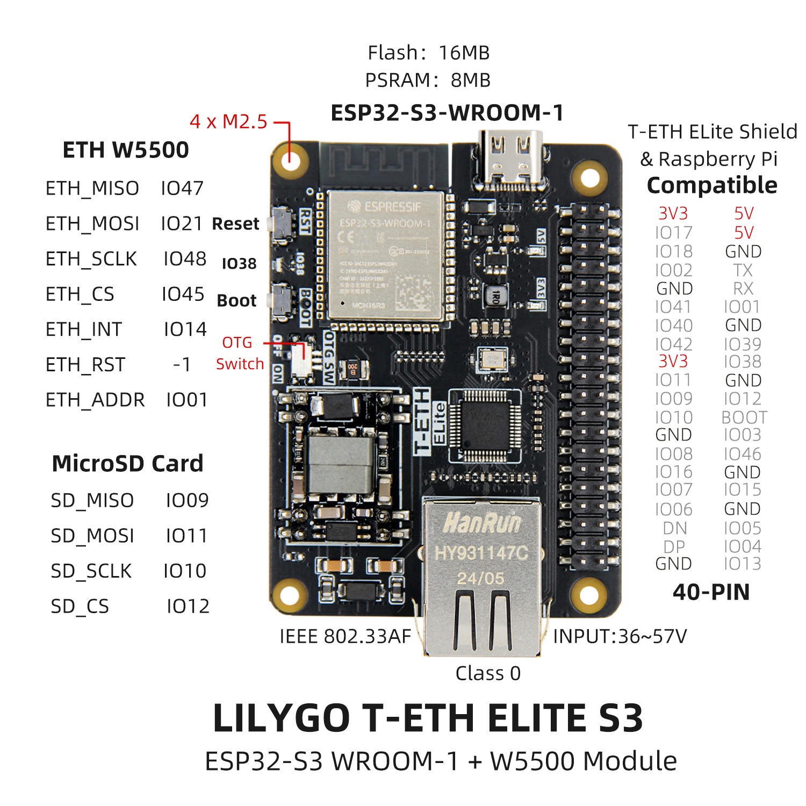
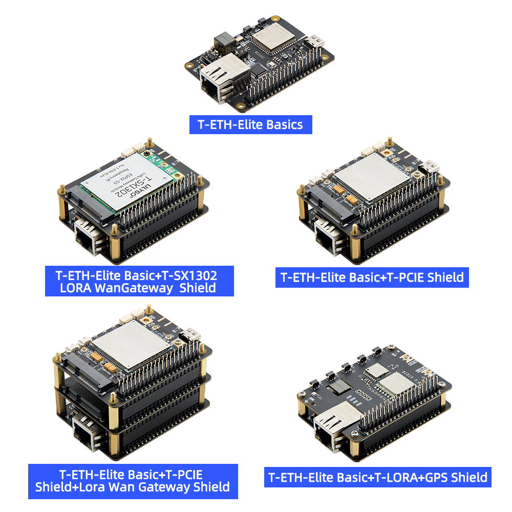

<!-- **[English](README.MD) | 中文** -->

    <a target="_blank" style="margin: 1em;color: white; font-size: 0.9em; border-radius: 0.3em; padding: 0.5em 2em; background-color:rgb(103, 175, 8)" href="https://lilygo.cc/products/t-eth-elite-1?variant=44498204983477">官网购买</a>
    <!-- <a target="_blank" style="margin: 1em;color: white; font-size: 0.9em; border-radius: 0.3em; padding: 0.5em 2em; background-color:rgb(63, 201, 28)" href="https://www.aliexpress.com/store/911876460">速卖通</a> -->

## 简介

LILYGO T-ETH ELITE  是一款基于 ESP32-S3-WROOM-1 模组的高性能物联网开发板，集成了 W5500 以太网控制器，支持以太网通信和 PoE（IEEE 802.3af Class 0）供电，输入电压范围为 36~57V。该板载 16MB Flash 和 8MB PSRAM，提供丰富的扩展接口，包括 MicroSD 卡槽（SPI 接口）、40-PIN GPIO（兼容树莓派引脚布局），以及以太网、USB OTG、UART 等外设接口。其设计兼顾了物联网应用的网络连接需求与硬件扩展灵活性，适用于智能家居、工业控制等场景，同时支持与树莓派等设备的兼容协作，为开发者提供了高效的双模（Wi-Fi/蓝牙 + 以太网）开发平台。

## 外观及功能介绍
### 外观

### 引脚图 

## 模块资料
### 概述

#### LORa 网关方案
组合：主板 + LORa 网关拓展板

功能：支持搭建 LORa 网络基础设施，兼容 SX1276/SX1262/SX1280/LR1121 等主流模块，可选配 GPS 实现精准定位（如 868/915MHz 频段）。

场景：适用于远距离、低功耗的广域物联网部署，如农业环境监测、智慧城市节点管理。

#### LORa 终端节点方案
组合：主板 + LORa 模块拓展板

功能：提供终端设备通信能力，支持多模 LORa 模块（SX1276/SX1262 等），可集成 GPS 实现位置追踪。

场景：物流追踪、资产定位、野外传感器数据回传等移动终端场景。

#### LTE 蜂窝网络方案
组合：主板 + LTE 通讯拓展板

功能：通过 4G/5G 蜂窝网络实现无依赖远程通信，覆盖 Wi-Fi/以太网无法部署的区域。

场景：工业设备远程监控、偏远地区数据传输、车载移动终端等。

#### 多协议融合方案
基础特性：主板原生集成 W5500 以太网（支持 TCP/UDP/IPv4）和 PoE 供电（36~57V），结合 ESP32-S3 的 双模 Wi-Fi/蓝牙，可同时支持有线+无线混合组网。

扩展性：通过 40-PIN GPIO 兼容树莓派生态，支持 MicroSD 存储、USB OTG 及外接传感器，满足边缘计算需求。

场景：智能家居中控、工业自动化控制、多协议网关等复杂系统集成。

| 组件 | 描述 |
| --- | --- |
| MCU | ESP32-S3R8 Dual-core LX7 microprocessor
| FLASH| 16M |
| PSRAM | 8M |
| TF 卡 | TF 卡扩展接口 |
| 无线 |2.4Ghz Wi-Fi + Bluetooth 5.0
| USB | 1 × USB Port and OTG(TYPE-C接口) |
| 拓展接口 | 1 × IEE802.3af PoE 接口 + 1 × 40-PIN GPIO 接口|
| 按键 | 1 x RESET 按键 + 1 x BOOT 按键 + 1 x OTG switch 按键 + 1 x IO38 按键 |
| 电源输入 | 5V/500mA |
| 孔位 | **4 × M2.5 定位孔** |
| 尺寸 |**50 X 67 X 17 mm**  |

### 相关资料链接

Github:[T-ETH-Series](https://github.com/Xinyuan-LilyGO/LilyGO-T-ETH-Series/tree/master)

#### 原理图

[T-ETH-ELite](https://github.com/Xinyuan-LilyGO/LilyGO-T-ETH-Series/blob/master/schematic/T-ETH-ELite.pdf)

#### 依赖库

- [Adafruit_BME280_Library](https://github.com/adafruit/Adafruit_BME280_Library)
- [Adafruit_BusIO](https://github.com/adafruit/Adafruit_BusIO)
- [Adafruit_NeoPixel](https://github.com/adafruit/Adafruit_NeoPixel)
- [Adafruit_Sensor](https://github.com/adafruit/Adafruit_Sensor)
- [ESP32_USB_Stream](https://github.com/esp-arduino-libs/ESP32_USB_Stream)
- [ETHClass2](https://github.com/Xinyuan-LilyGO/LilyGO-T-ETH-Series/blob/master/lib/ETHClass2)
- [LoRa](https://github.com/sandeepmistry/arduino-LoRa)
- [ModbusMaster](https://github.com/4-20ma/ModbusMaster)
- [RadioLib](https://github.com/jgromes/RadioLib)
- [StreamDebugger](https://github.com/plerup/StreamDebugger)
- [TFT_eSPI](https://github.com/Bodmer/TFT_eSPI)
- [TinyGPSPlus](https://github.com/mikalhart/TinyGPSPlus)
- [TinyGSM](https://github.com/vshymanskyy/TinyGSM)
- [U8g2](https://github.com/olikraus/u8g2)

## 应用参考

### 物联网应用
基于T-ETH-ELite和T-ETH-ELite-Gateway-Shield硬件组合的LoRa网关项目(以上两个硬件缺一不可)

配置方法一:

1. 手机连接 ESP32S3 产生网络热点名称为:LilyGo-Gateway 密码:12345678 
2. 在浏览器中输入`192.168.4.1` 打开网关配置页面
3. 根据标题填写相对应的栏目,填写完成之后点击Apply
4. 点击重启按钮,网关将重启按照填写的参数运行

配置方法二:

1. 通过网线接入以太网接口
2. 打开Serial监视器,从串行监视器中得到连接的IP地址，使用同一个局域网的电脑在浏览器中输入串行打印的IP地址,打开网关配置页面
3. 根据标题填写相对应的栏目,填写完成之后点击Apply
4. 点击重启按钮,网关将重启按照填写的参数运行

网关配置参数解释:

- **Next time Boot** : 点击重启之后运行的模式是什么,
  * Soft AP Mode : 网络热点模式,只用于配置网关设置
  * Station Mode : 站模式,用于连接AP
  * Ethernet Mode ： 以太网模式,此模式可以不设置连接WiFi
- **Frequency Plan** : LoRa网关运行的频率计划, 请根据使用地的法律法规进行设置 
  * CN470 : Asia
  * EU868 : Europe
  * US915 : USA
  * 请注意,频率计划要与实际使用的SX1302网关频率适应，比如购买的868MHz的LoRa网关，只能配置为868MHz，不能配置为470MHz,915MHz
  * 其他计划请参考 [The Things Network Regional Parameters][1]
- **Radio 1 Center Frequency**: 射频中心频率设置 , 中心频率仅供参考,根据当地法律法规进行填写 , 如果使用[TTN][1] ， 可以在配置网关完成后下载全局配置文件，找到中心频率，将它填写到栏目中
  * CN470 : 470600000 Hz 
  * EU868 : 867500000 Hz 
  * US915 : 915600000 Hz 
  * 请注意,频率计划要与实际使用的SX1302网关频率适应，比如购买的868MHz的LoRa网关，只能配置为868MHz，不能配置为470MHz,915MHz
- **Radio 2 Center Frequency**: 射频中心频率设置 , 中心频率仅供参考,根据当地法律法规进行填写, 如果使用[TTN][1] ， 可以在配置网关完成后下载全局配置文件，找到中心频率，将它填写到栏目中
  * CN470 : 471400000 Hz
  * EU868 : 868500000 Hz
  * US915 : 916300000 Hz
  * 请注意,频率计划要与实际使用的SX1302网关频率适应，比如购买的868MHz的LoRa网关，只能配置为868MHz，不能配置为470MHz,915MHz
- **Wi-Fi SSID**: 无线ap名称
  * 如果 Next time Boot 选择为 Ethernet Mode 可以不填写,如果要使用无线接入模式,则填写WiFi SSDI
- **Wi-Fi Password**: 无线ap密码
  * 如果 Next time Boot 选择为 Ethernet Mode 可以不填写，如果要使用无线接入模式,则填写WiFi 密码
- **NS Host**: LoRa 网关服务器域名或者IP地址
  * [The Things Network][2] 在创建网关完成之后可以在网关界面查看接入域名
- **NS Port**: LoRa 网关服务器端口
  * [The Things Network][2] 默认使用 1700 作为通讯端口
- **Gateway ID**: 八个字节的网关ID，可以随意填写十六进制的八个字节,不能与其他的网关ID重复,例如 E84E06FFFE316166

[1]: https://www.thethingsnetwork.org/docs/lorawan/regional-parameters/
[2]: https://www.thethingsnetwork.org

项目可参考Github：[LilyGO-ETH-Gateway](https://github.com/Xinyuan-LilyGO/LilyGO-ETH-Gateway)

YouTuBe参考视频：[TTN&LilyGO LoRa Gateway](https://www.youtube.com/watch?v=NyL87WWntP4)

## 软件开发
### Arduino 设置参数

| Arduino IDE Setting                  | Value                          |
|--------------------------------------|--------------------------------|
| Board                                | ESP32S3 Dev Module             |
| Port                                 | Your port                      |
| USB CDC On Boot                      | Disable                        |
| CPU Frequency                        | 240MHZ(WiFi)                   |
| Core Debug Level                     | None                           |
| USB DFU On Boot                      | Disable                        |
| Erase All Flash Before Sketch Upload | Disable                        |
| Events Run On                        | Core1                          |
| Flash Mode                           | QIO 80MHZ                      |
| Flash Size                           | 16MB(128Mb)                    |
| Arduino Runs On                      | Core1                          |
| USB Firmware MSC On Boot             | Disable                        |
| Partition Scheme                     | 16M Flash(3M APP/9.9MB FATFS)  |
| PSRAM                                | OPI PSRAM                      |
| Upload Mode                          | UART0/Hardware CDC             |
| Upload Speed                         | 921600                         |
| USB Mode                             | CDC and JTAG                   |
### 开发平台

1. [VS Code](https://code.visualstudio.com/)
2. [Arduino IDE](https://www.arduino.cc/en/software)
3. [Platform IO](https://platformio.org/)
4. [MicroPython](https://micropython.org/)

## 产品技术支持 

