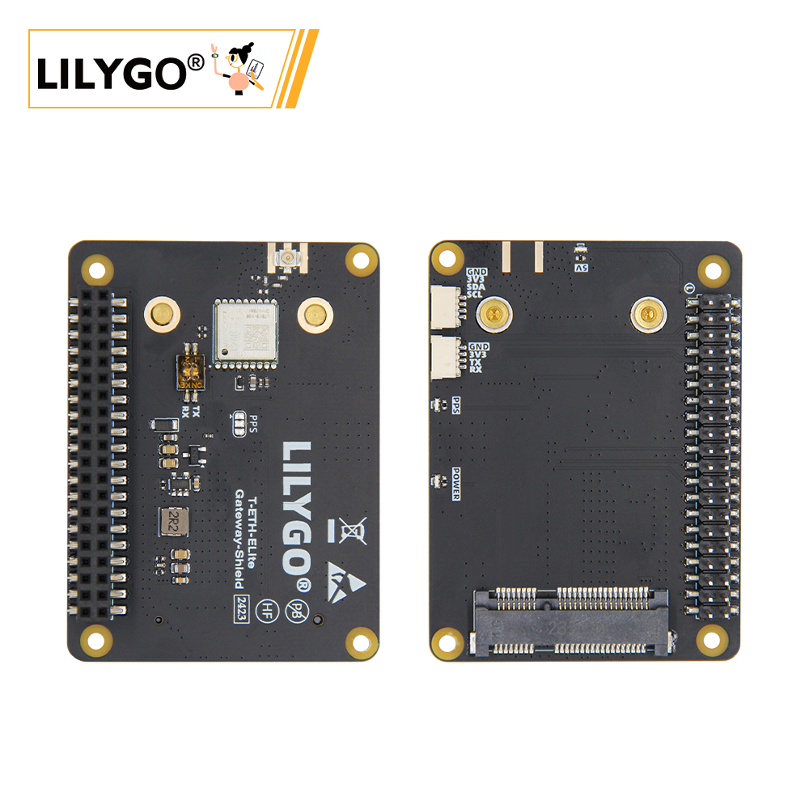

<!-- **[English](README.MD) | 中文** -->

    <a target="_blank" style="margin: 1em;color: white; font-size: 0.9em; border-radius: 0.3em; padding: 0.5em 2em; background-color:rgb(103, 175, 8)" href="https://lilygo.cc/products/t-eth-elite-1?variant=44498205016245">官网购买</a>
    <!-- <a target="_blank" style="margin: 1em;color: white; font-size: 0.9em; border-radius: 0.3em; padding: 0.5em 2em; background-color:rgb(63, 201, 28)" href="https://www.aliexpress.com/store/911876460">速卖通</a> -->

## 简介

LILYGO T-ETH ELITE S3 的 Gateway Shield（网关扩展板） 是一款多功能物联网网关解决方案，支持 LORa（SX1276/SX1262 等模块）、以太网（W5500 控制器）和 Wi-Fi/蓝牙双模通信，集成 GPS 定位与 PoE 供电（36~57V），可搭建广域网络枢纽，适用于农业监测、物流追踪及混合组网场景，兼容 Arduino/ESP-IDF 开发平台，兼具工业级可靠性与灵活扩展性。

## 外观及功能介绍
### 外观

### 引脚图 

## 模块资料
### 概述

T-ETH-ELITE 主板 + T-ETH-Gateway 拓展板:

组合：主板 + LORa 网关拓展板

功能：支持搭建 LORa 网络基础设施，兼容 SX1276/SX1262/SX1280/LR1121 等主流模块，可选配 GPS 实现精准定位（如 868/915MHz 频段）。

场景：适用于远距离、低功耗的广域物联网部署，如农业环境监测、智慧城市节点管理。

### 相关资料链接

Github:[T-ETH-Series](https://github.com/Xinyuan-LilyGO/LilyGO-T-ETH-Series/tree/master)

#### 原理图

[T-ETH-Gateway](https://github.com/Xinyuan-LilyGO/LilyGO-T-ETH-Series/blob/master/schematic/T-ETH-ELite-Gateway-Shield.pdf)

#### 依赖库

- [AceButton](https://github.com/bxparks/AceButton)
- [Adafruit_NeoPixel](https://github.com/adafruit/Adafruit_NeoPixel)
- [Adafruit_BME280_Library](https://github.com/adafruit/Adafruit_BME280_Library)
- [Adafruit_BusIO](https://github.com/adafruit/Adafruit_BusIO)
- [Adafruit_Sensor](https://github.com/adafruit/Adafruit_Sensor)
- [ESPAsyncWebServer](https://github.com/me-no-dev/ESPAsyncWebServer)
- [AsyncTCP](https://github.com/me-no-dev/AsyncTCP)
- [ESP8266Audio](https://github.com/earlephilhower/ESP8266Audio)
- [LilyGo TWR Library](https://github.com/Xinyuan-LilyGO/T-TWR)
- [SdFat - Adafruit Fork](https://github.com/adafruit/SdFat.git)
- [TFT_eSPI](https://github.com/Bodmer/TFT_eSPI)
- [TinyGPSPlus](https://github.com/mikalhart/TinyGPSPlus)
- [U8g2](https://github.com/olikraus/u8g2)
- [XPowersLib](https://github.com/lewisxhe/XPowersLib)

### 开发平台

1. [VS Code](https://code.visualstudio.com/)
2. [Arduino IDE](https://www.arduino.cc/en/software)
3. [Platform IO](https://platformio.org/)

## 产品技术支持 

