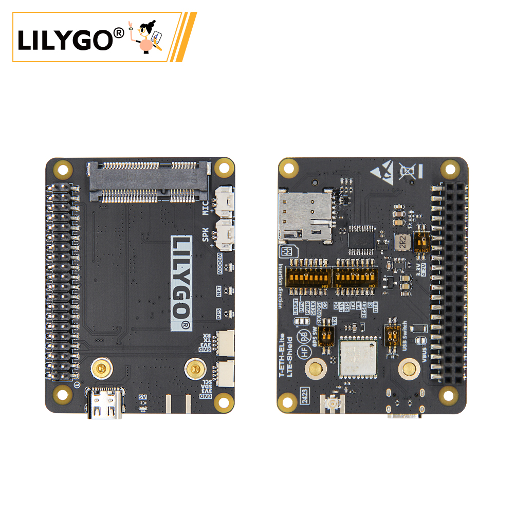

<!-- **[English](README.MD) | 中文** -->

    <a target="_blank" style="margin: 1em;color: white; font-size: 0.9em; border-radius: 0.3em; padding: 0.5em 2em; background-color:rgb(103, 175, 8)" href="https://lilygo.cc/products/t-eth-elite-1?variant=44498205049013">官网购买</a>
    <!-- <a target="_blank" style="margin: 1em;color: white; font-size: 0.9em; border-radius: 0.3em; padding: 0.5em 2em; background-color:rgb(63, 201, 28)" href="https://www.aliexpress.com/store/911876460">速卖通</a> -->

## 简介

LILYGO T-ETH ELITE-LTE Shield 是一款专为 T-ETH-Elite 主板设计的 4G 蜂窝网络扩展模块，集成 LTE 通信与 L76K 高精度 GPS 定位功能，支持在无网络覆盖区域实现远程数据传输。该模块兼容 T-PCIE LTE 模块，提供 T-PCIE 模式（4.2V 供电）与官方 PCIE 模式（3.3V 供电），灵活适配不同部署需求，同时内置 L76K GPS 模块，可精准追踪地理位置与同步时间，适用于物流管理、移动设备监控等场景。通过 40-PIN GPIO 接口（兼容树莓派布局）及专用通信引脚（如 MODEM_RX/TX），模块可无缝对接主板的以太网（W5500）、Wi-Fi/蓝牙及 PoE 供电（36~57V），构建 LTE+GPS+以太网多协议混合通信枢纽，开发时支持 Arduino、ESP-IDF 等平台，兼具工业级可靠性与扩展灵活性，是偏远地区物联网节点、车载终端及工业远程监控的理想解决方案。

## 外观及功能介绍
### 外观

### 引脚图 

## 模块资料
### 概述

T-ETH-ELITE 主板 + T-ETH-LTE 拓展板:

组合：主板 + LTE 通讯拓展板

功能：通过 4G/5G 蜂窝网络实现无依赖远程通信，覆盖 Wi-Fi/以太网无法部署的区域。

场景：工业设备远程监控、偏远地区数据传输、车载移动终端等。

### 相关资料链接

Github:[T-ETH-Series](https://github.com/Xinyuan-LilyGO/LilyGO-T-ETH-Series/tree/master)

#### 原理图

[T-ETH-LTE](https://github.com/Xinyuan-LilyGO/LilyGO-T-ETH-Series/blob/master/schematic/T-ETH-ELite-LTE-Shield.pdf)

#### 依赖库

- [AceButton](https://github.com/bxparks/AceButton)
- [Adafruit_NeoPixel](https://github.com/adafruit/Adafruit_NeoPixel)
- [Adafruit_BME280_Library](https://github.com/adafruit/Adafruit_BME280_Library)
- [Adafruit_BusIO](https://github.com/adafruit/Adafruit_BusIO)
- [Adafruit_Sensor](https://github.com/adafruit/Adafruit_Sensor)
- [ESPAsyncWebServer](https://github.com/me-no-dev/ESPAsyncWebServer)
- [AsyncTCP](https://github.com/me-no-dev/AsyncTCP)
- [ESP8266Audio](https://github.com/earlephilhower/ESP8266Audio)
- [LilyGo TWR Library](https://github.com/Xinyuan-LilyGO/T-TWR)
- [SdFat - Adafruit Fork](https://github.com/adafruit/SdFat.git)
- [TFT_eSPI](https://github.com/Bodmer/TFT_eSPI)
- [TinyGPSPlus](https://github.com/mikalhart/TinyGPSPlus)
- [U8g2](https://github.com/olikraus/u8g2)
- [XPowersLib](https://github.com/lewisxhe/XPowersLib)

### 开发平台

1. [VS Code](https://code.visualstudio.com/)
2. [Arduino IDE](https://www.arduino.cc/en/software)
3. [Platform IO](https://platformio.org/)

## 产品技术支持 

