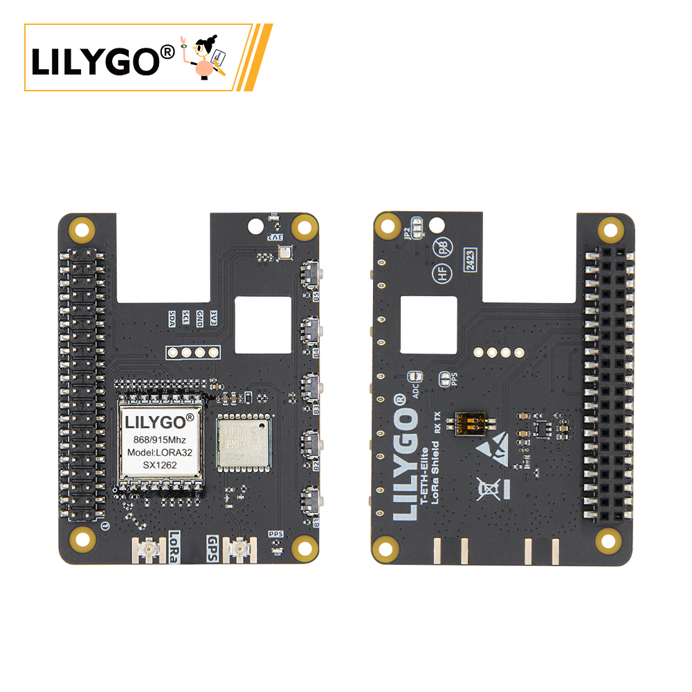
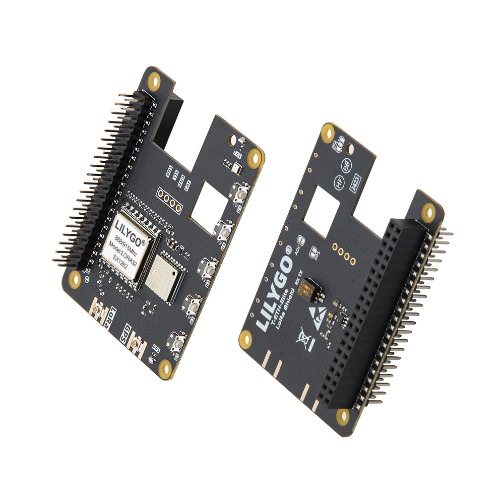
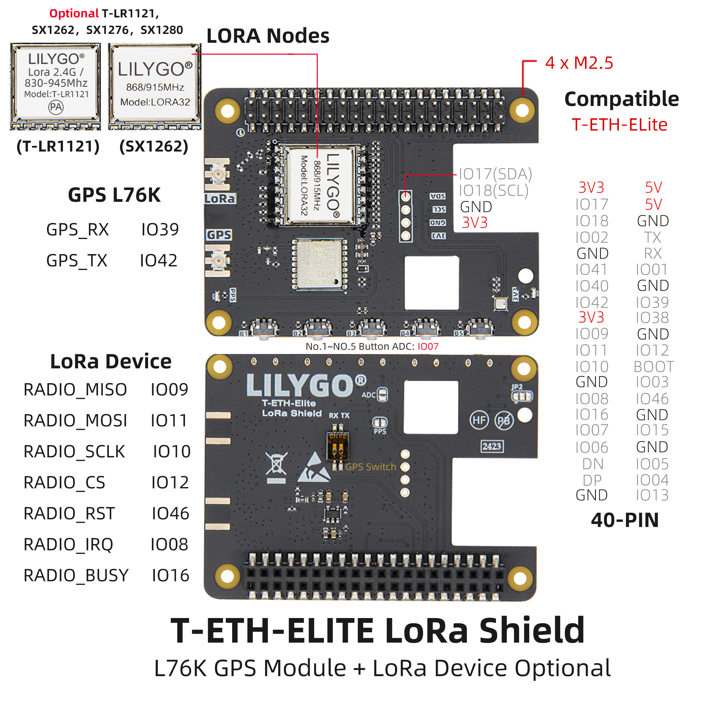
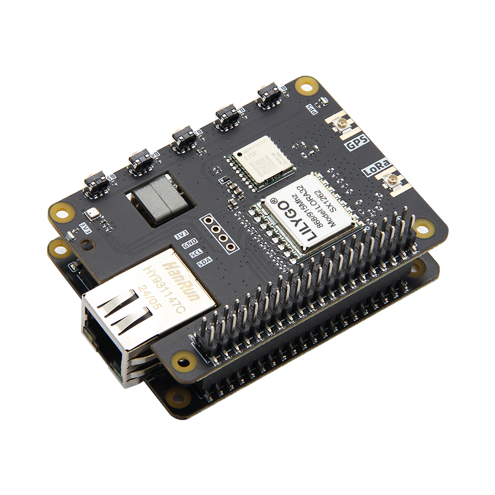

<!-- **[English](README.MD) | 中文** -->

    <a target="_blank" style="margin: 1em;color: white; font-size: 0.9em; border-radius: 0.3em; padding: 0.5em 2em; background-color:rgb(103, 175, 8)" href="https://lilygo.cc/products/t-eth-elite-1?variant=44498256298165">官网购买</a>
    <!-- <a target="_blank" style="margin: 1em;color: white; font-size: 0.9em; border-radius: 0.3em; padding: 0.5em 2em; background-color:rgb(63, 201, 28)" href="https://www.aliexpress.com/store/911876460">速卖通</a> -->

## 简介

LILYGO T-ETH LoRa Shield 是一款专为 T-ETH-Elite 主板设计的扩展模块，集成 多频段 LoRa 通信（支持 T-LR1121、SX1262/SX1276/SX1280 等模块，覆盖 2.4GHz 及 830-945MHz 频段）与 L76K 高精度 GPS 定位，适用于远距离物联网通信与位置追踪。模块提供 40-PIN GPIO（兼容树莓派布局）、SPI 接口（MISO/MOSI/SCLK/CS）及控制引脚（RST/IRQ/BUSY），支持快速部署 LoRa 节点或外接传感器，并通过 4 个 M2.5 安装孔实现稳固扩展。结合主板的以太网（W5500）、Wi-Fi/蓝牙及 PoE 供电，可构建混合通信网关，广泛应用于智慧农业、物流追踪、环境监测等场景，开发友好，适配 Arduino、ESP-IDF 等平台。

## 外观及功能介绍
### 外观

### 引脚图 

## 模块资料
### 概述

T-ETH-ELITE 主板 + T-ETH-LoRa 拓展板:

组合：主板 + LORa 模块拓展板

功能：提供终端设备通信能力，支持多模 LORa 模块（SX1276/SX1262 等），可集成 GPS 实现位置追踪。

场景：物流追踪、资产定位、野外传感器数据回传等移动终端场景。

### 相关资料链接

Github:[T-ETH-Series](https://github.com/Xinyuan-LilyGO/LilyGO-T-ETH-Series/tree/master)

#### 原理图

[T-ETH-LoRa](https://github.com/Xinyuan-LilyGO/LilyGO-T-ETH-Series/blob/master/schematic/T-ETH-ELite-LoRa-Shield.pdf)

#### 依赖库

- [AceButton](https://github.com/bxparks/AceButton)
- [Adafruit_NeoPixel](https://github.com/adafruit/Adafruit_NeoPixel)
- [Adafruit_BME280_Library](https://github.com/adafruit/Adafruit_BME280_Library)
- [Adafruit_BusIO](https://github.com/adafruit/Adafruit_BusIO)
- [Adafruit_Sensor](https://github.com/adafruit/Adafruit_Sensor)
- [ESPAsyncWebServer](https://github.com/me-no-dev/ESPAsyncWebServer)
- [AsyncTCP](https://github.com/me-no-dev/AsyncTCP)
- [ESP8266Audio](https://github.com/earlephilhower/ESP8266Audio)
- [LilyGo TWR Library](https://github.com/Xinyuan-LilyGO/T-TWR)
- [SdFat - Adafruit Fork](https://github.com/adafruit/SdFat.git)
- [TFT_eSPI](https://github.com/Bodmer/TFT_eSPI)
- [TinyGPSPlus](https://github.com/mikalhart/TinyGPSPlus)
- [U8g2](https://github.com/olikraus/u8g2)
- [XPowersLib](https://github.com/lewisxhe/XPowersLib)

### 开发平台

1. [VS Code](https://code.visualstudio.com/)
2. [Arduino IDE](https://www.arduino.cc/en/software)
3. [Platform IO](https://platformio.org/)

## 产品技术支持 

