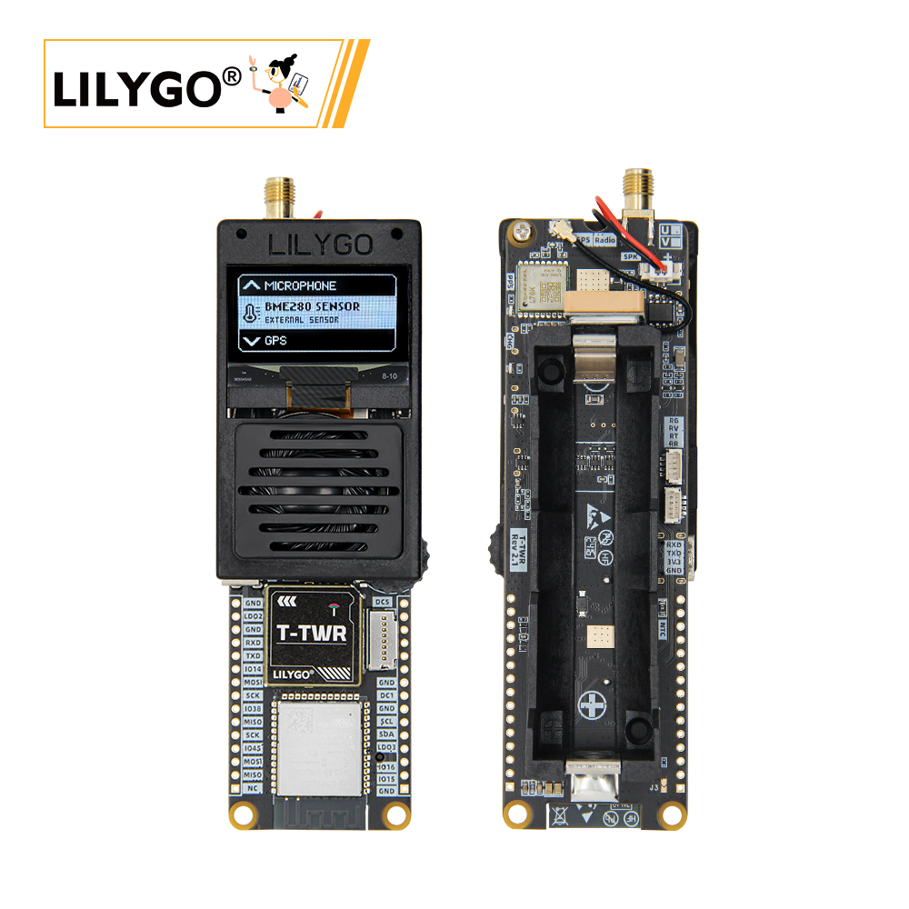
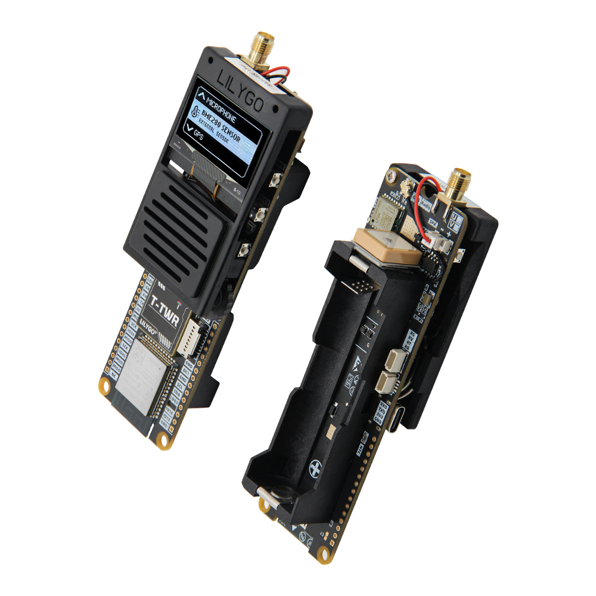
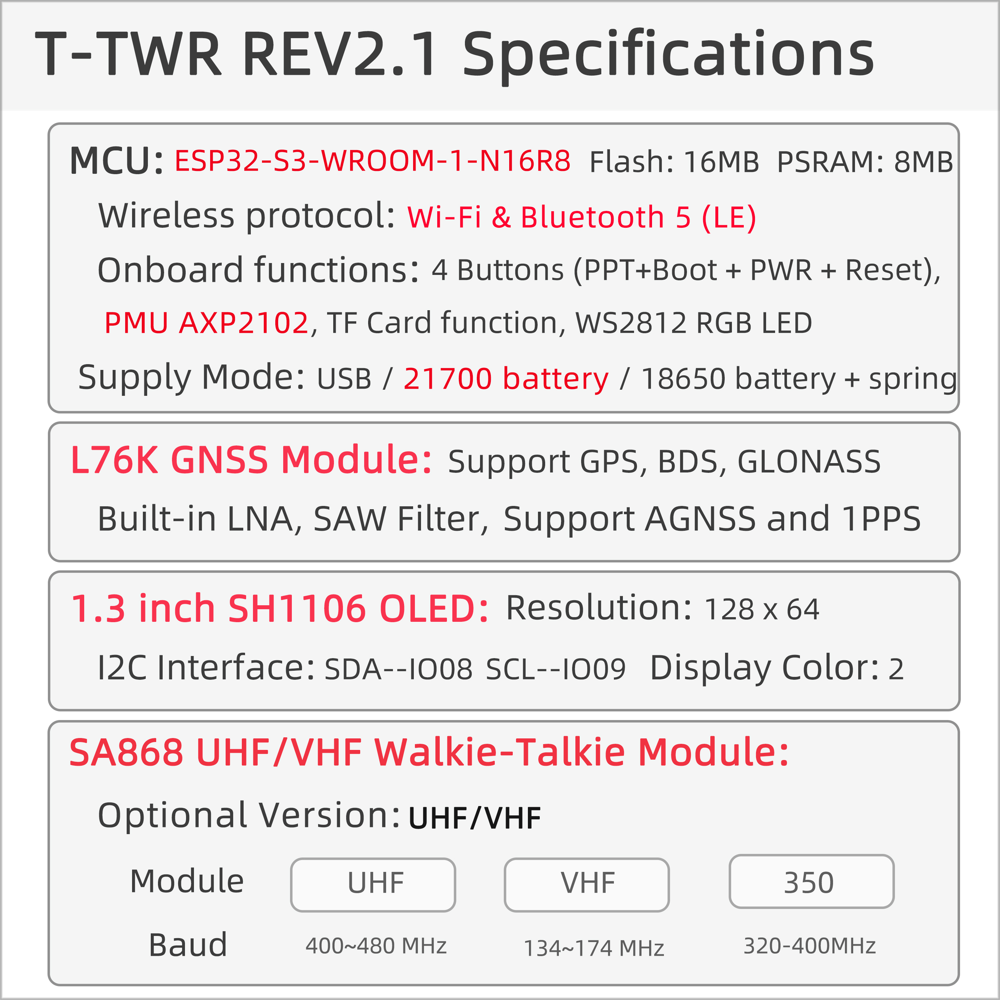

<!-- **[English](README.MD) | 中文** -->

    <a target="_blank" style="margin: 1em;color: white; font-size: 0.9em; border-radius: 0.3em; padding: 0.5em 2em; background-color:rgb(103, 175, 8)" href="https://lilygo.cc/products/t-twr-rev2-1?variant=44505308528821">官网购买</a>
    <!-- <a target="_blank" style="margin: 1em;color: white; font-size: 0.9em; border-radius: 0.3em; padding: 0.5em 2em; background-color:rgb(63, 201, 28)" href="https://www.aliexpress.com/store/911876460">速卖通</a> -->

> 注意：T-TWR 有UHF以及VHF两种频段的接收机版本,主要的区别在于对讲机的频段不一样,UHF对讲机频段为400-480MHz,VHF对讲机频段为134-174MHz。

## 简介

LILYGO T-TWR REV2.1 是一款基于 ESP32-S3-WROOM-1-N16R8 的高集成开发板，搭载 16MB Flash 和 8MB PSRAM，支持 Wi-Fi/蓝牙 5（LE） 双模通信，内置 PMU AXP2102 电源管理单元，支持 USB/21700/18650 电池 多种供电模式，适用于便携式设备开发。其核心功能包括 L76K GNSS 模块（支持 GPS、BDS、GLONASS 多系统定位及 AGNSS 辅助）、1.3 英寸 SH1106 OLED 屏（128×64 分辨率，I²C 接口 SDA-1008/SCL-1009）、SA868 UHF/VHF 对讲机模块（可选 134-174MHz 或 350-480MHz 频段）及 WS2812 RGB LED 状态指示灯。此外，板载 4 个功能按键（PTT、Boot、PWR、Reset）、TF 卡扩展、麦克风输入、EME280/CITEMAL 环境传感器接口，可广泛用于物联网终端、户外定位导航、无线通信、环境监测及低功耗嵌入式系统开发，兼具工业级可靠性与多功能扩展性。

## 外观及功能介绍
### 外观

### 引脚图 

## 模块资料
### 概述

| 组件 | 描述 |
| --- | --- |
| MCU | ESP32-S3-WR0OM-1-N16R8 
| FLASH| 16M |
| PSRAM | 8M (Octal SPI)|
| 屏幕 | SH1106 OLED |
| 收音机 | SA868 UHF/VHF 对讲机模块 |
| 音频 | RS2257XC6 音频采集模块 |
| GNSS | L76K GNSS 模块 |
| 电源管理 | PMU AXP2102 |
| 电池 | 21700 电池 / 18650 电池 + spring电池 |
| 编码器 | 支持编码器控制
| LED | WS2812 RGB LED |
| TF 卡 | TF 卡扩展接口 |
| 无线 |2.4Ghz Wi-Fi + Bluetooth 5.0
| USB | 1 × USB Port and OTG(TYPE-C接口) |
| IO 接口 | 2 × 15 pin拓展IO接口 |
| 拓展接口 | 2 × 1mm 4-pin STEMMA QT / QWIIC接口 + 1 × 天线接口|
| 按键 | 1 x RESET 按键 + 1 x BOOT 按键 + 1 x PWR 按键 + 1 x PTT 按键 |
| 电源 | 5V/500mA |
| 孔位 | **2 × 2mm 定位孔** |
| 尺寸 |产品: **126* 39 *29 mm**  天线: **200mm**  |

### 相关资料链接

Github:[T-TWR](https://github.com/Xinyuan-LilyGO/T-TWR)

- [SA868](https://github.com/Xinyuan-LilyGO/T-TWR/blob/master/datasheet/SA868%202W%20Embedded%20walkie%20talkie%20moduleV1.3.pdf)
- [SPEC](https://github.com/Xinyuan-LilyGO/T-TWR/blob/master/datasheet/SPEC%20X096-2864KSWPG17-C30%20VER%20A.pdf)

#### 原理图

[T-TWR](https://github.com/Xinyuan-LilyGO/T-TWR/blob/master/schematic/T-TWR-Plus_Rev2.1.pdf)

#### 依赖库

- [AceButton](https://github.com/bxparks/AceButton)
- [Adafruit_NeoPixel](https://github.com/adafruit/Adafruit_NeoPixel)
- [Adafruit_BME280_Library](https://github.com/adafruit/Adafruit_BME280_Library)
- [Adafruit_BusIO](https://github.com/adafruit/Adafruit_BusIO)
- [Adafruit_Sensor](https://github.com/adafruit/Adafruit_Sensor)
- [ESPAsyncWebServer](https://github.com/me-no-dev/ESPAsyncWebServer)
- [AsyncTCP](https://github.com/me-no-dev/AsyncTCP)
- [ESP8266Audio](https://github.com/earlephilhower/ESP8266Audio)
- [LilyGo TWR Library](https://github.com/Xinyuan-LilyGO/T-TWR)
- [SdFat - Adafruit Fork](https://github.com/adafruit/SdFat.git)
- [TFT_eSPI](https://github.com/Bodmer/TFT_eSPI)
- [TinyGPSPlus](https://github.com/mikalhart/TinyGPSPlus)
- [U8g2](https://github.com/olikraus/u8g2)
- [XPowersLib](https://github.com/lewisxhe/XPowersLib)

## 软件开发
### Arduino 设置参数

| Arduino IDE Setting                  | Value                          |
|--------------------------------------|--------------------------------|
| Board                                | ESP32S3 Dev Module             |
| Port                                 | Your port                      |
| USB CDC On Boot                      | Enable                         |
| CPU Frequency                        | 240MHZ(WiFi)                   |
| Core Debug Level                     | None                           |
| USB DFU On Boot                      | Disable                        |
| Erase All Flash Before Sketch Upload | Disable                        |
| Events Run On                        | Core1                          |
| Flash Mode                           | QIO 80MHZ                      |
| Flash Size                           | 16MB(128Mb)                    |
| Arduino Runs On                      | Core1                          |
| USB Firmware MSC On Boot             | Disable                        |
| Partition Scheme                     | 16M Flash(3M APP/9.9MB FATFS)  |
| PSRAM                                | OPI PSRAM                      |
| Upload Mode                          | UART0/Hardware CDC             |
| Upload Speed                         | 921600                         |
| USB Mode                             | CDC and JTAG                   |
### 开发平台

1. [VS Code](https://code.visualstudio.com/)
2. [Arduino IDE](https://www.arduino.cc/en/software)
3. [Platform IO](https://platformio.org/)

## 产品技术支持 

