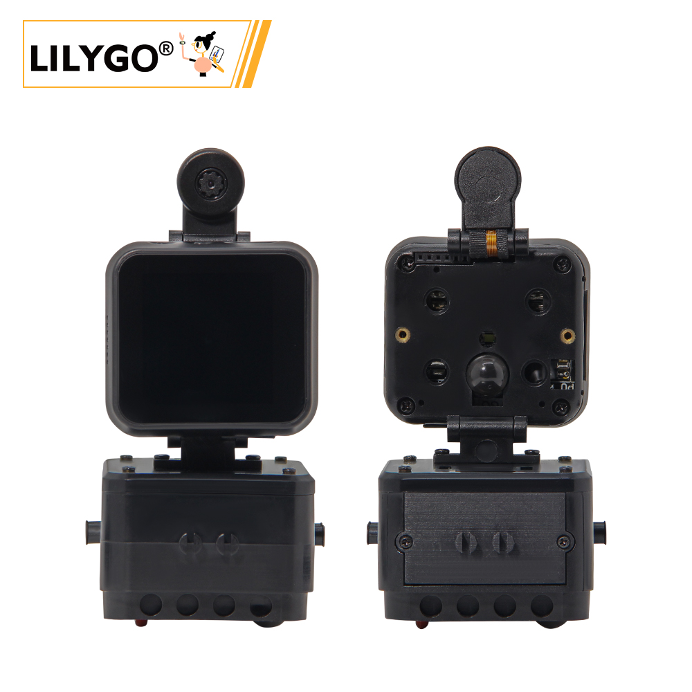
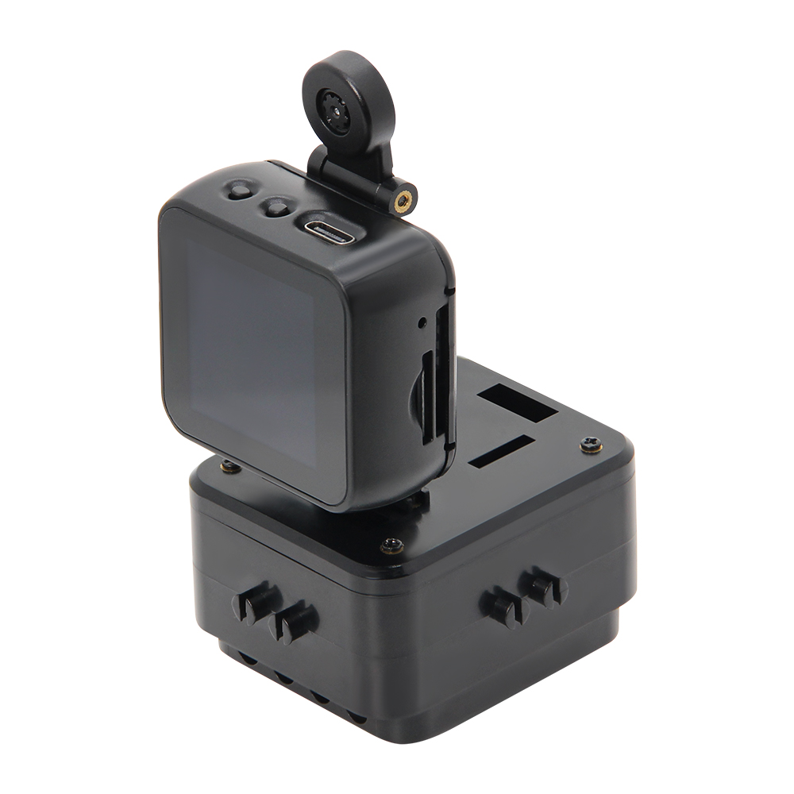
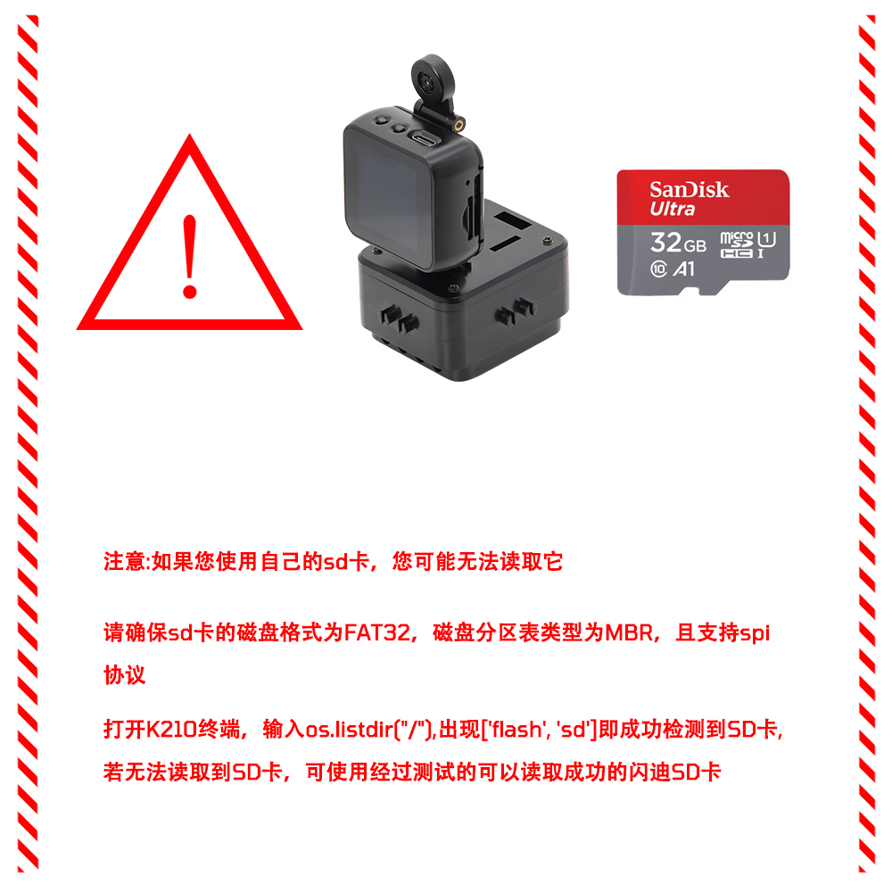

<!-- **[English](README.MD) | 中文** -->

    <a target="_blank" style="margin: 1em;color: white; font-size: 0.9em; border-radius: 0.3em; padding: 0.5em 2em; background-color:rgb(103, 175, 8)" href="https://lilygo.cc/products/t-bao">官网购买</a>
    <!-- <a target="_blank" style="margin: 1em;color: white; font-size: 0.9em; border-radius: 0.3em; padding: 0.5em 2em; background-color:rgb(63, 201, 28)" href="https://www.aliexpress.com/store/911876460">速卖通</a> -->

## 简介

T-BAO是一款基于ESP32-S3-WROOM-1开发板的开源AIoT终端，具备高性能、低功耗、低成本、可拓展、可编程的特点。同时兼容Arduino、高性能嵌入式人工智能开发平台，深度融合K210 RISC-V架构AI芯片与ESP32双核Wi-Fi/BLE通信模组，搭载专业级OV2640 200万像素摄像头（支持180°旋转调节）及ST7789V 1.54英寸IPS触控屏（90°自适应旋转显示），实现毫秒级人脸识别与动态图像处理。内置MAX98357A I2S数字功放、MSM261S高灵敏度麦克风阵列及硬件编解码单元，支持语音交互与高清音频输出。采用AXP202智能电源管理系统，支持3.7V锂电池供电与超低功耗运行，集成MPU6050六轴传感器、TF卡存储扩展及丰富接口资源（UART/SPI/I2C/Touch），全面兼容Arduino/MicroPython生态。适用于工业视觉检测、智能安防、AIoT终端及教育机器人等场景，提供开源SDK与完整开发文档，助力快速商业落地。

## 外观及功能介绍
### 外观

### 引脚图 

## 模块资料以及参数
### 注意事项

>!⚠️SD卡的注意事项:

### 开发板参数

| 组件 | 描述 |
| ---  | --- |
|MCU	|ESP32-D0WDQ6-V3 Xtensa LX6 Dual Core
|Flash 	|16M 
|PSRAM  |8M
|时钟|	240Mhz
|GPS	|MIA-M10Q
|无线| 	Wi-Fi: 802.11 b/g/n, Bluetooth: V4.2 + BLE
|存储 | TF 卡 |
|电机 |drv8833|
|电源管理|AXP202 PMU|
|陀螺仪|MPU6050|
|摄像头|OV2640 (两百万像素)|
|屏幕| ST7789 1.54-inch IPS Capacitive Touch LCD (240x240)
|按键 | 1 x RST 按键   1 x BOOT 按键以及旋钮   4 × 屏幕按键 |
| USB |1 × type-C接口|
|UI | LVGL
| 拓展接口 | 2 × QWIIC接口 + 4 × 磁吸接口|
| 尺寸 | **164x46x42mm**  |
|USB 电源| 5V/500mA|

<table role="table" class="center_table">
    <thead>
        <tr>
            <th colspan = "2">K210 芯片基本参数</th>   
        </tr>
    </thead>
    <tbody>
    <tr>    
        <td>内核</td>
        <td>RISC-V Dual Core 64bit, with FPU</td>
    </tr>
    <tr>
        <td>主频</td>
        <td>400MHz （可超频至600MHz）</td>
    </tr>
    <tr>
        <td>SRAM</td>
        <td>内置8M Byte</td>
    </tr>
    <tr>
        <td>图像识别</td>
        <td>QVGA@60fps/VGA@30fps</td>
    </tr>
    <tr>
        <td>语音识别</td>
        <td>麦克风阵列(8mics)</td>
    </tr>
    <tr>
        <td>网络模型</td>
        <td><li>支持YOLOv3<li>Mobilenetv2<li>TinyYOLOv2<li>人脸识别等</td>
    </tr>
    <tr>
        <td>深度学习框架</td>
        <td>支持TensorFlow \ Keras \ Darknet \ Caffe 等主流框架</td>
    </tr>
    <tr>
        <td>外设</td>
        <td>FPIOA、 UART、 GPIO、 SPI、 I2C、I2S、 TIMER</td>
    </tr>
    <tr>
        <td>视频处理</td>
        <td><li>神经网络处理器(KPU)<li>FPU满足IEEE754-2008标准<li>音频处理器(APU)<li>快速傅里叶变换加速器(FFT)</td>
    </tr>
  </tbody>
</table>

### 相关资料
Github：[T-Bao](https://github.com/Xinyuan-LilyGO/LilyGo-K210-Script)

> [MicroPython](https://docs.micropython.org/en/latest/) 是基于 Python3 的语法做的一款解析器，包含了 Python3 的大多数基础语法， 主要运行在性能和内存有限的嵌入式芯片上。（注意 Micropython 不包含 Python3 的所有语法）

* [MicroPython](https://docs.micropython.org/en/latest/library/index.html)
* [ESP32](https://docs.espressif.com/projects/esp-idf/en/v5.4.1/esp32/get-started/index.html)
#### 原理图

[T-Bao](https://github.com/Xinyuan-LilyGO/LilyGo-K210-Script/blob/master/schematic/K210_Main.pdf)

<!-- * [SY6970](./datasheet/AN_SY6970.pdf) -->

#### 使用说明

<table role="table" class="center_table">
  <thead>
    <tr>
      <th colspan = "2">Direction Tracking</th>
    </tr>
  </thead>
    <tr>
    <td>ESP32 Firmware</td>
    <td>ESP32_AT_Firmware_UART1_SGPIO.bin</td>
  </tr>:
  <tr>
    <td>K210 Firmware</td>
    <td>maixpy_twatch_v0.6.2-75-g973361c0d-dirty.bin</td>
  </tr>
  <tr>
    <td>Direction model</td>
    <td>Identify_Direction_model.kmodel</td>
  </tr>
</table>

<table role="table" class="center_table">
  <thead>
    <tr>
      <th colspan = "2">Direction Tracking</th>
    </tr>
  </thead>
    <tr>
    <td>ESP32 Firmware</td>
    <td>ESP32_AT_Firmware_UART1_SGPIO.bin</td>
  </tr>:
  <tr>
    <td>K210 Firmware</td>
    <td>maixpy_twatch_v0.6.2-75-g973361c0d-dirty.bin</td>
  </tr>
  <tr>
    <td>Direction model</td>
    <td>face_model_at_0x300000.kfpkg</td>
  </tr>
</table>

<table role="table" class="center_table">
  <thead>
    <tr>
      <th colspan = "2">speech_recognizer</th>
    </tr>
  </thead>
    <tr>
    <td>ESP32 Firmware</td>
    <td>ESP32_AT_Firmware_UART1_SGPIO.bin</td>
  </tr>:
  <tr>
    <td>K210 Firmware</td>
    <td>maixpy_v0.6.2_83_gf0280db50_minimum_speech_with_ide_support.bin</td>
  </tr>
  <tr>
    <td>Direction model</td>
    <td>maix_asr_2900k_0x500000.kmodel</td>
  </tr>
</table>

>!这里需要注意使用kflash_gui工具把maix_asr_2900k_0x500000.kmodel写入地址0x500000，并先烧录maixpy_v0.6.2_83_gf0280db50_minimum_speech_with_ide_support.bin

## 软件开发
### 固件烧录

最新的固件可以在[这里](https://cn.dl.sipeed.com/MAIX/MaixPy/release/master)下载，根据自己的需求选择固件，然后烧录到开发板上。

固件下载工具可以从这里下载：[kflash_gui](https://cn.dl.sipeed.com/shareURL/MAIX/tools)

### 开发平台
1. [ESP-IDF](https://www.espressif.com/zh-hans/products/sdks/esp-idf)
2. [Arduino IDE](https://www.arduino.cc/en/software)

## 产品技术支持 

