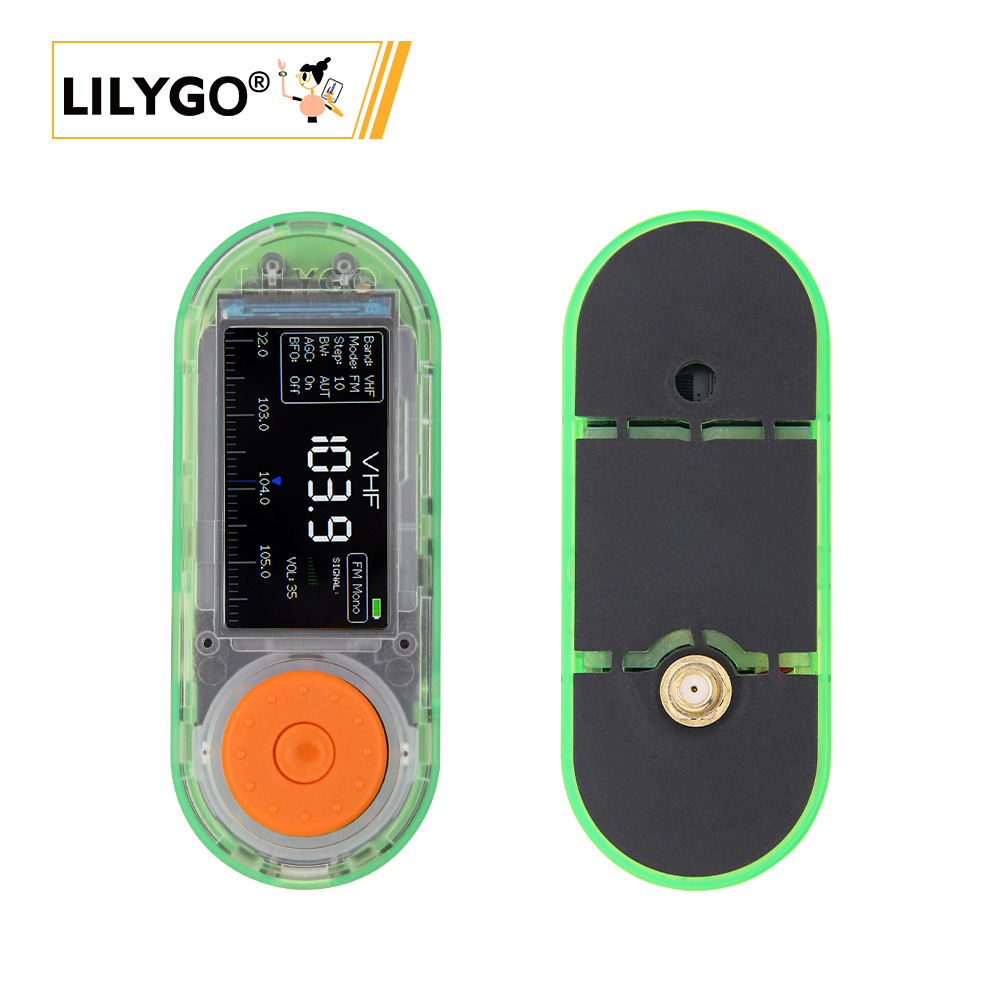

<!-- **[English](README.MD) | 中文** -->

<!-- 

    <a target="_blank" style="margin: 1em;color: white; font-size: 0.9em; border-radius: 0.3em; padding: 0.5em 2em; background-color:rgb(63, 201, 28)" href="https://item.taobao.com/item.htm?id=846226367137">淘宝</a>
    <a target="_blank" style="margin: 1em;color: white; font-size: 0.9em; border-radius: 0.3em; padding: 0.5em 2em; background-color:rgb(63, 201, 28)" href="https://www.aliexpress.com/store/911876460">速卖通</a>

 -->

## 简介

LILYGO T-Embed SI4732 这是基于基础款T-Embed 增加SI4732扩展模块的版本，SI4732一款高性能数字调谐收音机芯片，专为 AM/FM/SW/LW 等广播频段接收设计。它集成了数字信号处理（DSP）技术，具备高灵敏度、低功耗和高度集成化特性，适用于多种收音机及音频设备。T-Embed是一款圆角矩形外观设计，集成 灯环编码器和1.9寸 IPS TFT，同时带有Mesh MIC和扬声器，内部TF卡槽和电源管理电路，支持3.7V 锂电池供电，扩展接口有GROVE和2.54间距GPIO扩展口。

## 外观及功能介绍
### 外观

### 引脚图 

## 模块资料以及参数

### 开发板参数

| 组件 | 描述 |
| ---  | --- |
|MCU	|ESP32-S3 Dual-core LX7 microprocessor
|Flash 	|16M 
|PSRAM  |8M
|GPS	|MIA-M10Q
|无线| 	Wi-Fi 802.11 b/g/n，BLE 5
|存储 | TF 卡 |
|屏幕|  1.9 inch ST7789V IPS color TFT LCD
|收音机	| Si4732-A10(CMOS AM/FM/SW/LW/RDS radio receiverIC)
|电池| 702550, 900MAH
|编码器| 编码器旋钮
|按键 | 1 x RST 按键 + 1 x BOOT 按键 |
|麦克风| 1 x ES7210麦克风
| USB |1 × type-C接口|
| RGB | APA102
| 孔位 | 2×2mm 定位孔 |
| 尺寸 | **98x39x39mm**  |

### 相关资料
Github：[T-Embed-SI4732](https://github.com/Xinyuan-LilyGO/T-Embed)

* [PN532](https://github.com/Xinyuan-LilyGO/T-Embed-CC1101/blob/master/hardware/PN532_C1.pdf)
* [bq25896](https://github.com/Xinyuan-LilyGO/T-Embed-CC1101/blob/master/hardware/bq25896.pdf)
* [bq27220](https://github.com/Xinyuan-LilyGO/T-Embed-CC1101/blob/master/hardware/bq27220_datasheet.pdf)

#### 原理图

[T-Embed-SI4732](https://github.com/Xinyuan-LilyGO/T-Embed-CC1101/blob/master/hardware/T-Embed-CC1101%20V1.0%2024-07-29.pdf)

#### 依赖库

* [RadioLib](https://github.com/jgromes/RadioLib)
* [PN532](https://github.com/Seeed-Studio/PN532.git)
* [XPowersLib](https://github.com/lewisxhe/XPowersLib)
* [TFT_eSPI](https://github.com/Bodmer/TFT_eSPI)
* [RotaryEncoder](http://www.mathertel.de/Arduino/RotaryEncoderLibrary.aspx)
* [FastLED](https://github.com/FastLED/FastLED)
* [IRremoteESP8266](https://github.com/crankyoldgit/IRremoteESP8266)
* [ESP32-audioI2S](https://github.com/schreibfaul1/ESP32-audioI2S)
* [LVGL](https://github.com/lvgl/lvgl/tree/v8.4.0)
* [PU2CLR SI4735](https://github.com/pu2clr/SI4735)

## 软件开发
### Arduino 设置参数

| Arduino IDE 设置  | Value      |
| --------------- | ------------------ |
| Board      | **ESP32S3 Dev Module**            |
| Port           | Your port                   |
| USB CDC On Boot          | Enable                    |
| CPU Frequency           | 240MHZ(WiFi)                 |
| Core Debug Level        | None                     |
| USB DFU On Boot         | Disable                           |
| Erase All Flash Before Sketch Upload | Disable        |
| Events Run On       | Core1            |
| Flash Mode       | QIO 80MHZ                         |
| Flash Size       | **16MB(128Mb)**                   |
| Arduino Runs On    | Core1          |
| USB Firmware MSC On Boot  | Disable           |
| Partition Scheme    | **16M Flash(3M APP/9.9MB FATFS)** |
| PSRAM    | **OPI PSRAM**           |
| Upload Mode       | **UART0/Hardware CDC**            |
| Upload Speed    | 921600                            |
| USB Mode         | **CDC and JTAG**                  |
  

### 开发平台
1. [ESP-IDF](https://www.espressif.com/zh-hans/products/sdks/esp-idf)
2. [Arduino IDE](https://www.arduino.cc/en/software)

## 产品技术支持 

