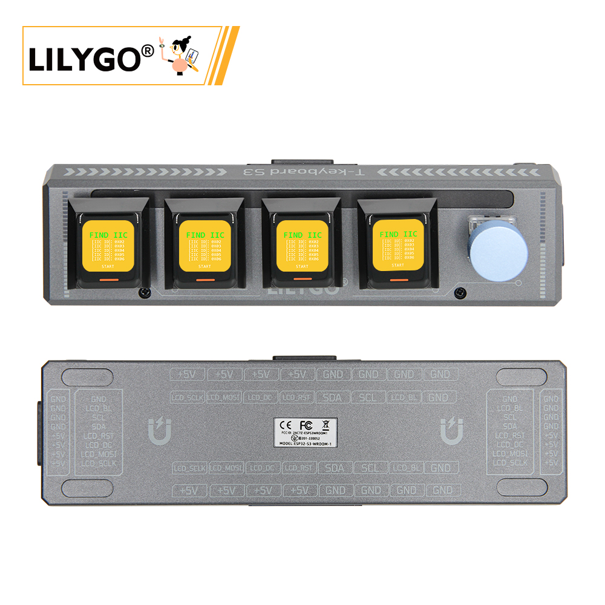
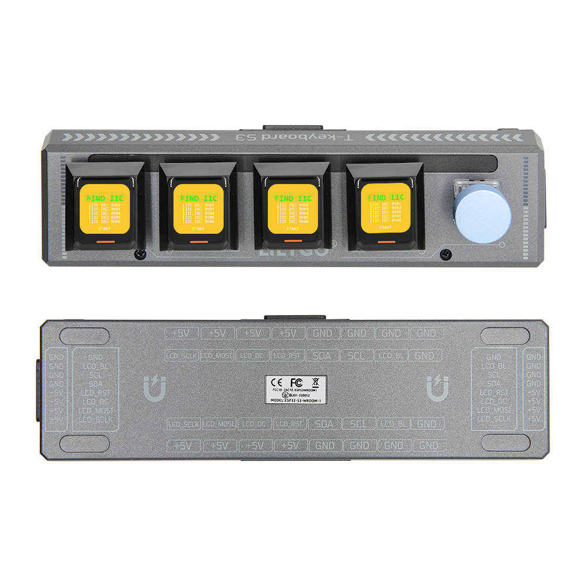
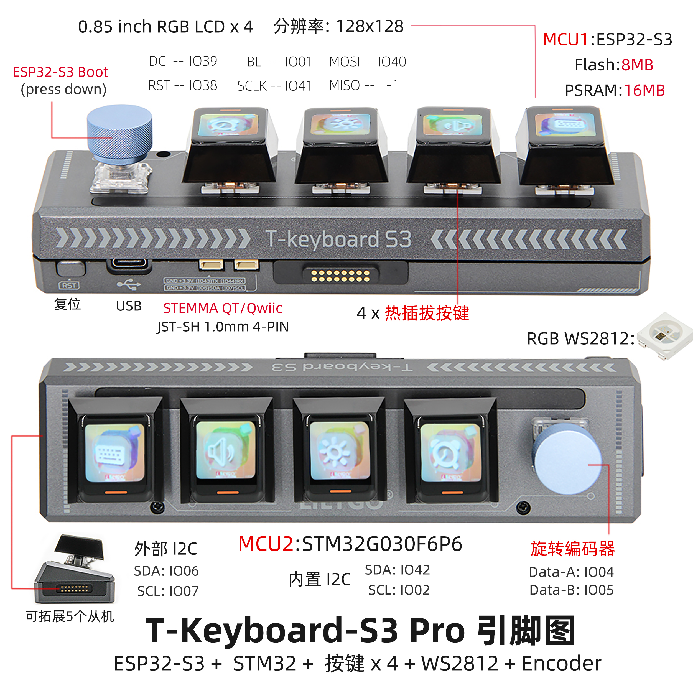

<!-- **[English](README.MD) | 中文** -->

<!-- 

    <a target="_blank" style="margin: 1em;color: white; font-size: 0.9em; border-radius: 0.3em; padding: 0.5em 2em; background-color:rgb(63, 201, 28)" href="https://item.taobao.com/item.htm?id=846226367137">淘宝</a>
    <a target="_blank" style="margin: 1em;color: white; font-size: 0.9em; border-radius: 0.3em; padding: 0.5em 2em; background-color:rgb(63, 201, 28)" href="https://www.aliexpress.com/store/911876460">速卖通</a>

 -->
>! 使用时必须要有主机，从机通过磁吸接口与主机连接
## 简介

T-Keyboard-S3 Pro 是一款基于 双 MCU 架构（ESP32-S3 + STM32G030F6P6） 的高端可编程键盘，专为开发者与专业用户打造。其核心亮点包括 4 块 0.85 英寸 RGB LCD 屏幕（分辨率 128x128），支持多屏独立显示快捷指令、系统状态或动态交互界面，通过 SPI 接口（MOSI/SCLK）驱动，实现高效视觉交互；4 个热插拔机械按键兼容自定义轴体，搭配 RGB WS2812 灯效与 旋转编码器（Data-A/B 引脚），可编程背光模式及精准参数调节（如音量、滚动控制）。硬件上，主控 ESP32-S3 配备 8MB Flash + 16MB PSRAM，支持 Wi-Fi/蓝牙通信与复杂逻辑运算，外置 STM32 芯片通过 I2C 总线（SDA: IO06/IO42, SCL: IO07/IO02）辅助处理实时输入任务，确保低延迟响应。扩展性方面，提供 STEMMA QT/Qwlic、JST-SH 4-PIN 接口及 5 个从机的 I2C 扩展能力，可连接传感器、触控板等外设，打造多功能控制终端。

## 外观及功能介绍
### 外观

### 引脚图 

## 模块资料以及参数
### 注意事项

>!1.默认固件配置为 I2C 通信扩展模式。请注意，若要扩展从设备数量，必须确保每个设备具有唯一的 I2C 地址，以避免地址冲突。从设备不能独立使用，正确的用法是由一个主设备与多个从设备进行通信的系统中使用。 
>2.最多可连接 6 个设备。当连接多个设备时，需要将板载 LED 的最大亮度调低至 10。 
>3.由于硬件长距离走线的限制，开发板在扩展方向上存在一定限制。主控板左右两侧各只能扩展一个设备，向下最多可扩展两个设备（USB 接口会阻碍扩展）。
>因此，最多可形成一个 2x3 的网格布局，总共支持 6 个设备。

### 开发板参数

| 组件 | 描述 |
| ---  | --- |
|MCU	|ESP32-S3R8 Dual-core LX7 microprocessor
|Flash 	|16M 
|PSRAM  |8M
|GPS	|MIA-M10Q
|无线| 	Wi-Fi 802.11 b/g/n，BLE 5
|存储 | TF 卡 |
|屏幕|  0.85 inch All ViewTFT LCD 主机有四个屏幕按键，从机有五个按键
|按键 | 1 x RST 按键   1 x BOOT 按键以及旋钮   4 × 屏幕按键 |
| USB |1 × type-C接口|
|UI | LVGL
| 拓展接口 | 2 × QWIIC接口 + 4 × 磁吸接口|
| 尺寸 | **164x46x42mm**  |

<table role="table" class="center_table">
  <thead>
    <tr>
      <th colspan = "2">STM32模块</th>
    </tr>
  </thead>
    <tr>
    <td>主控</td>
    <td>STM32G030F6P6</td>
  </tr>
  <tr>
    <td>Flash</td>
    <td>64kb</td>
  </tr>
  <tr>
    <td>PSRAM</td>
    <td>8kb</td>
  </tr>
</table>

### 相关资料
Github：[T-Keyboard S3 Pro](https://github.com/Xinyuan-LilyGO/T-Keyboard-S3-Pro)

* [ESP32­-S3-WROOM­-1](https://www.espressif.com/sites/default/files/documentation/esp32-s3-wroom-1_wroom-1u_datasheet_en.pdf)
* [STM32G030F6P6](https://www.st.com/en/microcontrollers-microprocessors/stm32g030f6.html#documentation)
* [GC9107](https://github.com/Xinyuan-LilyGO/T-Keyboard-S3-Pro/blob/main/information/GC9107_DataSheet_V1.2.pdf)
* [WS2812C](https://github.com/Xinyuan-LilyGO/T-Keyboard-S3-Pro/blob/main/information/WS2812C-2020.pdf)

#### 原理图

[T-Keyboard S3 Pro](https://github.com/Xinyuan-LilyGO/T-Keyboard-S3-Pro/blob/main/project/SCH_T-Keyboard-S3-Pro_Keyboard_V1.1.pdf)

<!-- * [SY6970](./datasheet/AN_SY6970.pdf) -->

#### 依赖库

* [RadioLib](https://github.com/Xk-w/Arduino_DriveBus)
* [TFT_eSPI](https://github.com/Bodmer/TFT_eSPI)
* [LVGL](https://github.com/lvgl/lvgl/tree/v8.4.0)
* [Arduino_GFX](https://github.com/moononournation/Arduino_GFX)

## 软件开发
### Arduino 设置参数

| Arduino IDE 设置  | Value      |
| --------------- | ------------------ |
| Board      | **ESP32S3 Dev Module**            |
| Port           | Your port                   |
| USB CDC On Boot          | Enable                    |
| CPU Frequency           | 240MHZ(WiFi)                 |
| Core Debug Level        | None                     |
| USB DFU On Boot         | Disable                           |
| Erase All Flash Before Sketch Upload | Disable        |
| Events Run On       | Core1            |
| Flash Mode       | QIO 80MHZ                         |
| Flash Size       | **16MB(128Mb)**                   |
| Arduino Runs On    | Core1          |
| USB Firmware MSC On Boot  | Disable           |
| Partition Scheme    | **16M Flash(3M APP/9.9MB FATFS)** |
| PSRAM    | **OPI PSRAM**           |
| Upload Mode       | **UART0/Hardware CDC**            |
| Upload Speed    | 921600                            |
| USB Mode         | **CDC and JTAG**                  |
  

### 开发平台
1. [ESP-IDF](https://www.espressif.com/zh-hans/products/sdks/esp-idf)
2. [Arduino IDE](https://www.arduino.cc/en/software)

## 产品技术支持 

