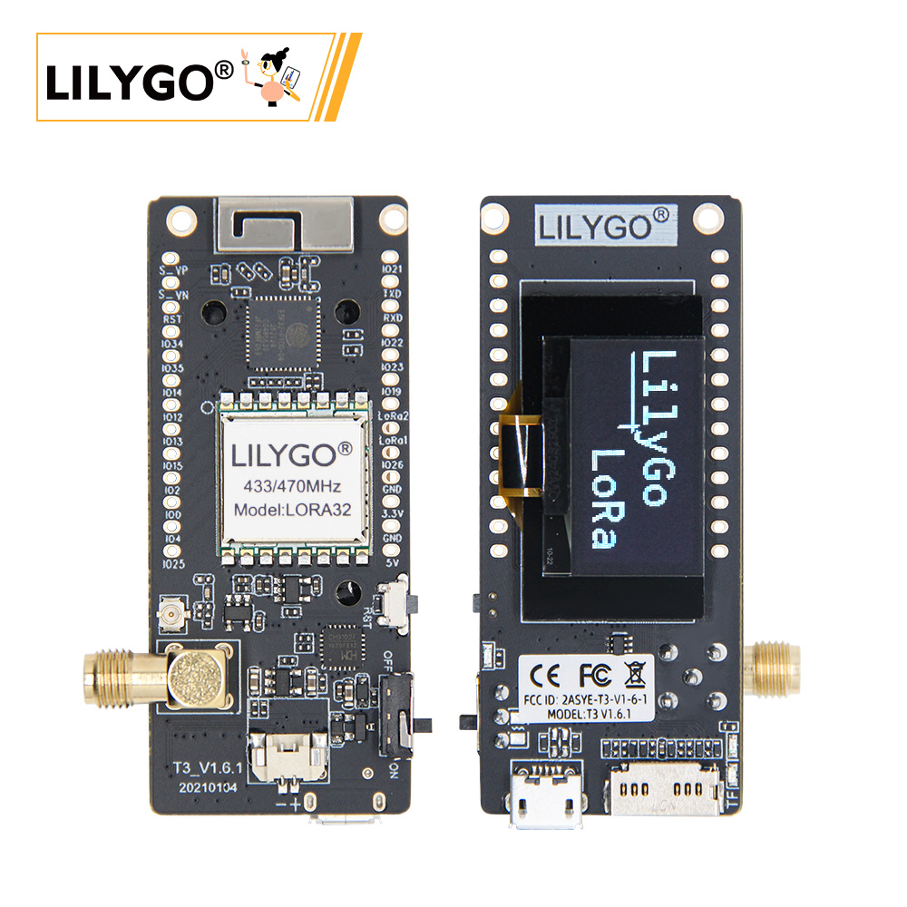
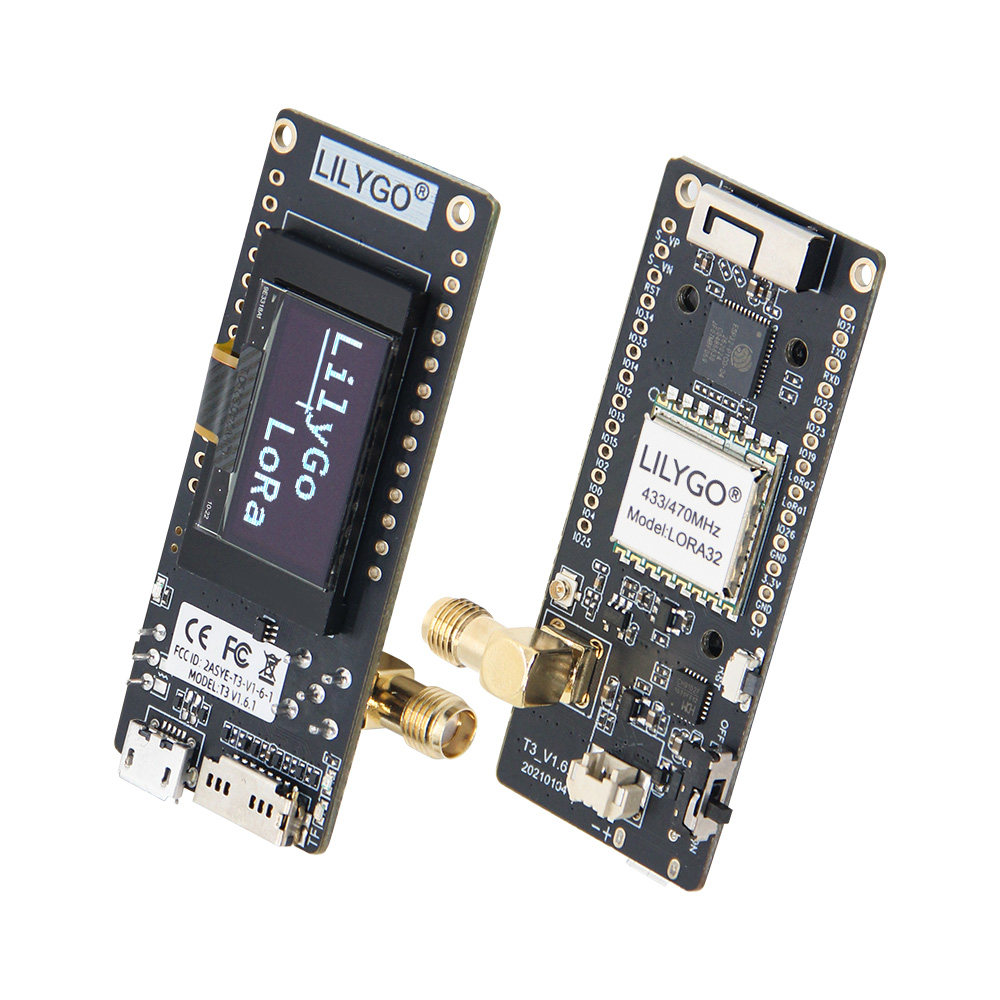
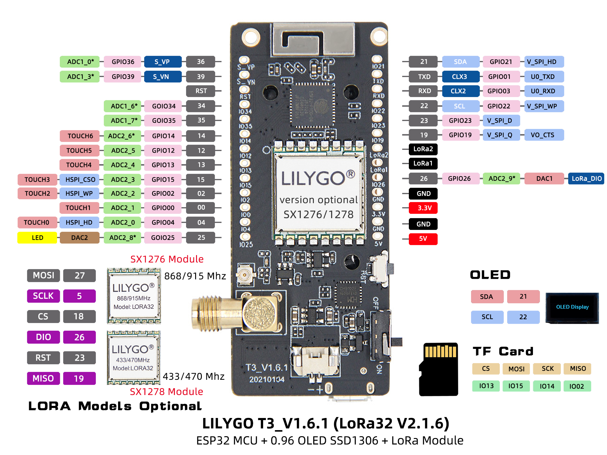
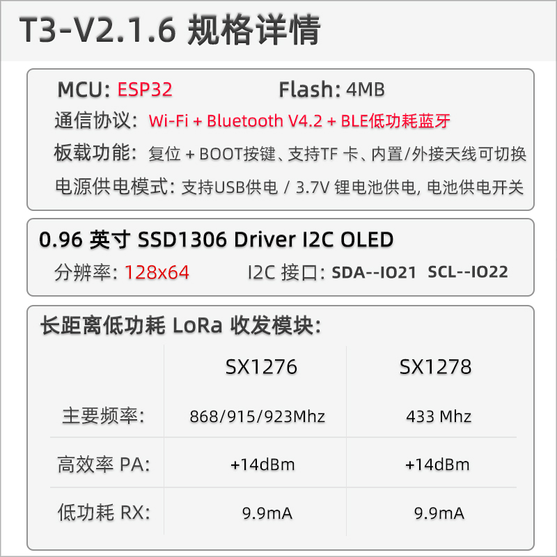
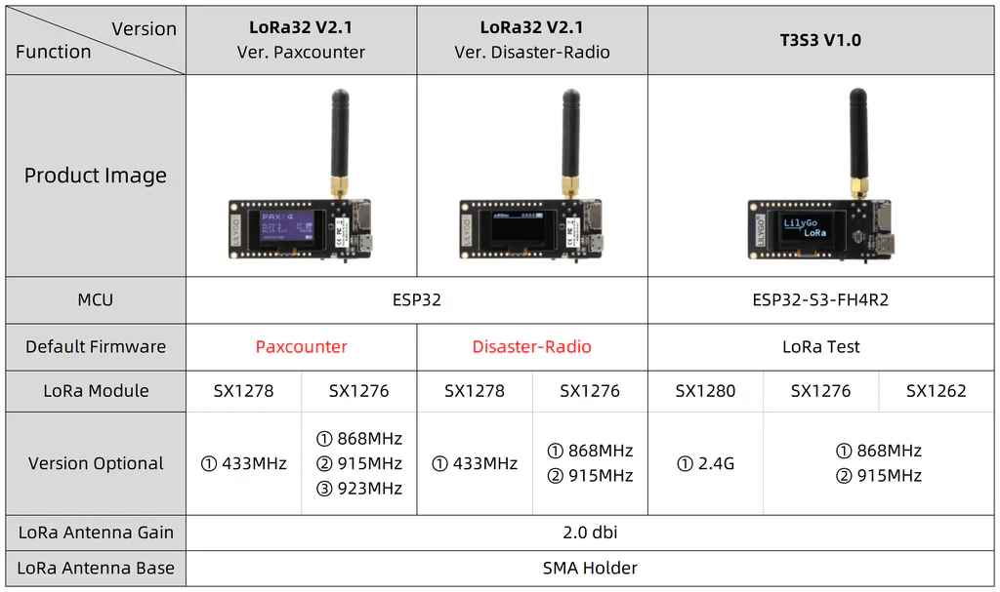

<!-- **[English](README.MD) | 中文** -->

    <a target="_blank" style="margin: 1em;color: white; font-size: 0.9em; border-radius: 0.3em; padding: 0.5em 2em; background-color:rgb(63, 201, 28)" href="https://lilygo.cc/products/lora3">官网购买</a>
    <!-- <a target="_blank" style="margin: 1em;color: white; font-size: 0.9em; border-radius: 0.3em; padding: 0.5em 2em; background-color:rgb(63, 201, 28)" href="https://www.aliexpress.com/store/911876460">速卖通</a>-->

 

## 简介

LILYGO T3_V1.6.1（LoRa32 V2.1.6）多协议物联网开发板 是一款集成 ESP32主控（4MB Flash）、0.96英寸SSD1306 I²C OLED屏（128×64分辨率，SDA/SCL引脚固定为IO21/IO22） 及低功耗LoRa模块（支持SX1276/SX1278双频段） 的复合型硬件平台。它支持 Wi-Fi + 蓝牙4.2 + BLE无线协议，提供双电源供电模式（USB接口或3.7V Li-Po电池，带电源切换开关），并具备 TF卡扩展槽 和硬件复位/启动按键；其 LoRa模块 可实现 +14dBm发射功率 与 9.9mA超低接收电流，适用于远程环境监测、LoRaWAN终端、低功耗传感器网关等物联网场景开发。

## 外观及功能介绍
### 外观

### 引脚图 

## 模块资料
### 概述

>!LoRa32 与 T3-S3的区别

| 组件 | 描述 |
| --- | --- |
| MCU | 	ESP32
| FLASH| 		4MB |
| PSRAM | 8MB|
| 串口芯片 | 	CH9102 |
| LoRa | SX1276:868/915/923Mhz SX1278:433Mhz |
| 屏幕 | 0.96英寸 OLED 屏幕 |
| 存储 | TF 卡 |
| 无线 |2.4Ghz Wi-Fi + Bluetooth 5.0
| USB | 1 × USB Port and OTG(mirco接口) |
| IO 接口 | 2.54mm间距 × 2*13拓展IO接口 |
| 按键 | 1 x RESET 按键 + 1 x BOOT 按键　 |
| 拓展接口 | 1 x 3D WiFi天线接口 + 1 x 支持LoRa外接天线(但需要跳线) + 1 x 1.25mm JST GH 2pin 电源接口  |
| 电源 | 5V/500mA |
| 孔位 | **2 x 2mm定位孔** |
| 尺寸 | **66x36x15mm**  |

### 相关资料链接

Github:[LoRa32](https://github.com/Xinyuan-LilyGO/LilyGo-LoRa-Series)

- [SX1262 datasheet](https://www.semtech.com/products/wireless-rf/lora-transceivers/sx1262)
- [LR1121 datasheet](https://www.semtech.com/products/wireless-rf/lora-connect/lr1121)
- [GSP MAX-M10 datasheet](https://www.u-blox.com/zh/product/max-m10-series)
- [PCF8563 datasheet](https://github.com/Xinyuan-LilyGO/LilyGo-LoRa-Series/blob/master/lib/SensorsLib/datasheet/PCF8563%20Datasheet%20Rev.11.pdf)
- [QMI8658 datasheet](https://github.com/Xinyuan-LilyGO/LilyGo-LoRa-Series/blob/master/lib/SensorsLib/datasheet/QMI8658A%20Datasheet%20Rev1.0.pdf)
- [QMC6310 datasheet](https://github.com/Xinyuan-LilyGO/LilyGo-LoRa-Series/blob/master/lib/SensorsLib/datasheet/QMC6310%20Datasheet%20Rev.C.pdf)
- [BME280 datasheet](https://www.bosch-sensortec.com/products/environmental-sensors/humidity-sensors-bme280/)
- [Quectel_L76K_GNSS_Protocol_Specification_V1.2](https://github.com/Xinyuan-LilyGO/LilyGo-LoRa-Series/blob/master/docs/datasheet/Quectel_L76KL26K_GNSS_协议规范_V1.2.pdf)
- [CASIC_ProtocolSpecification](https://github.com/Xinyuan-LilyGO/LilyGo-LoRa-Series/blob/master/docs/datasheet/CASIC_ProtocolSpecification.pdf)

#### 原理图

[LoRa32](https://github.com/Xinyuan-LilyGO/LilyGo-LoRa-Series/blob/master/schematic/T3_V1.6.1.pdf)

#### 依赖库

- [AXP202](https://github.com/lewisxhe/AXP202X_Library)
- [AceButton](https://github.com/bxparks/AceButton)
- [Arduino_GFX](https://github.com/moononournation/Arduino_GFX)
- [Adafruit_BME280_Library](https://github.com/adafruit/Adafruit_BME280_Library)
- [Adafruit_BusIO](https://github.com/adafruit/Adafruit_BusIO)
- [Adafruit_Sensor](https://github.com/adafruit/Adafruit_Sensor)
- [ESP8266_SSD1306](https://github.com/ThingPulse/esp8266-oled-ssd1306)
- [GxEPD](https://github.com/ZinggJM/GxEPD)
- [LMIC-Arduino](https://github.com/matthijskooijman/LMIC-node)
- [LoRa](https://github.com/sandeepmistry/arduino-LoRa)
- [RadioLib](https://github.com/jgromes/RadioLib)
- [TFT_eSPI](https://github.com/Bodmer/TFT_eSPI)
- [TinyGPSPlus](https://github.com/mikalhart/TinyGPSPlus)
- [TinyGSM](https://github.com/vshymanskyy/TinyGSM)
- [U8g2](https://github.com/olikraus/u8g2)

#### 注意事项

> 使用者如有需要调节外接天线电阻请参考

>!箭头处指向处可更换电阻实现调整外接天线的电阻

## 软件开发
### Arduino 设置参数

| T-Beam S3 Supreme                    | Value                          |
|--------------------------------------|--------------------------------|
| Board                                | ESP32S3 Dev Module             |
| Port                                 | Your port                      |
| USB CDC On Boot                      | Enable                         |
| CPU Frequency                        | 240MHZ(WiFi)                   |
| Core Debug Level                     | None                           |
| USB DFU On Boot                      | Disable                        |
| Erase All Flash Before Sketch Upload | Disable                        |
| Events Run On                        | Core1                          |
| Flash Mode                           | QIO 80MHZ                      |
| Flash Size                           | 8MB(64Mb)                      |
| Arduino Runs On                      | Core1                          |
| USB Firmware MSC On Boot             | Disable                        |
| Partition Scheme                     | 8M Flash(3M APP/1.5MB SPIFFS)  |
| PSRAM                                | QSPI PSRAM                     |
| Upload Mode                          | UART0/Hardware CDC             |
| Upload Speed                         | 921600                         |
| USB Mode                             | CDC and JTAG                   |
| Programmer                           | Esptool                        |        

### 开发平台
1. [ESP-IDF](https://www.espressif.com/zh-hans/products/sdks/esp-idf)
2. [Arduino IDE](https://www.arduino.cc/en/software)
3. [VS Code](https://code.visualstudio.com/)
4. [Micropython](https://micropython.org/)

## 产品技术支持 

