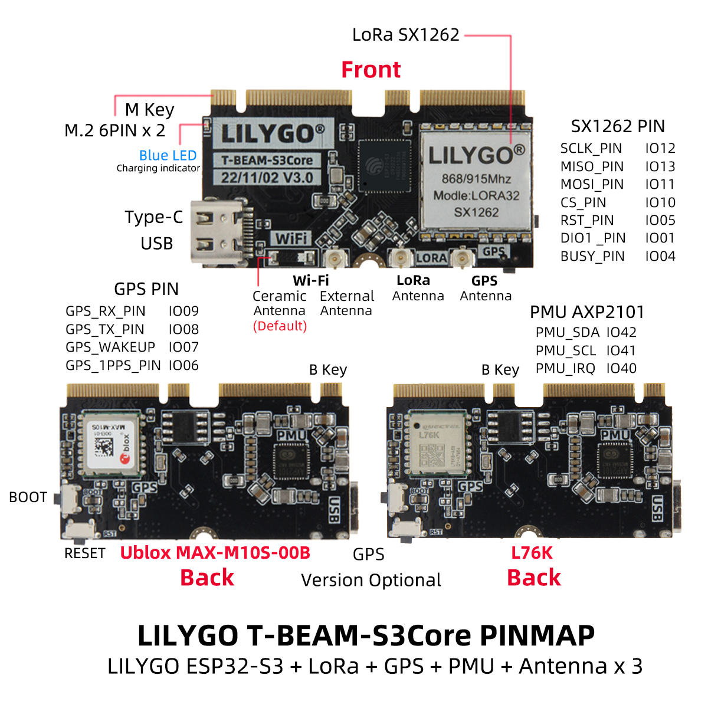

<!-- **[English](README.MD) | 中文** -->

    <a target="_blank" style="margin: 1em;color: white; font-size: 0.9em; border-radius: 0.3em; padding: 0.5em 2em; background-color:rgb(63, 201, 28)" href="https://lilygo.cc/products/t-beam-supreme">官网购买</a>
    <!-- <a target="_blank" style="margin: 1em;color: white; font-size: 0.9em; border-radius: 0.3em; padding: 0.5em 2em; background-color:rgb(63, 201, 28)" href="https://www.aliexpress.com/store/911876460">速卖通</a>-->

 

## 简介

T-BEAM-SUPREME V3.0 是一款高性能多功能的物联网开发板，基于 ESP32-S3FN8 双核处理器设计，支持 Wi-Fi 802.11 b/g/n 和蓝牙 5.0，提供灵活的无线连接能力。开发板兼容 Arduino-IDE、MicroPython 和 VS Code 编程环境，搭载 8MB PSRAM 和 8MB Flash 存储，并集成 六轴传感器（QM6）、3.7V 18650 电池供电接口及多功能按键（Boot/复位/电源）。其配备 1.3 英寸 SH1106 OLED 屏幕（128x64 分辨率，I2C 接口），支持 LoRa SX1262 模块（覆盖 433/868/915/923MHz 频段），可实现远距离低功耗通信。此外，用户可灵活选择 Ublox MAX-M10S 或 L76K GPS 模块版本，满足精准定位需求，适用于智能硬件、环境监测及物联网节点开发等场景。

## 外观及功能介绍
### 外观

### 引脚图 

## 模块资料
### 概述

#### 核心板

>拓展板上可以选择使用 MAX-M10S 或 L76K GPS 模块，
>`MAX-M10S `模块支持 9600/19200/38400/57600/115200 波特率的串口通信，支持 NMEA 0183 协议，`L76K GPS` 模块支持 9600/19200/38400/57600/115200 波特率的串口通信，支持 UBX 协议。

#### 拓展板

| 组件 | 描述 |
| --- | --- |
| MCU | ESP32-S3FN8 Dual-core LX7 microprocessor
| FLASH| 	8MB |
| PSRAM | 8MB|
| RTC | PCF85063ATL (IIC)|
| 麦克风 | MP34DT05-A (PDM)|
| 电源管理芯片 | AXP2101
| 六轴传感器 |  QMI8658 |
| 温湿度气压传感器 | BME280
| LoRa | SX1262:868、915Mhz SX1280:2.4Ghz |
| 屏幕 | 1.3英寸 SH1106 OLED 屏幕 |
| 存储 | TF 卡 |
| 无线 |2.4Ghz Wi-Fi + Bluetooth 5.0
| USB | 1 × USB Port and OTG(TYPE-C接口) |
| IO 接口 | 2.54mm间距 × 2*13拓展IO接口 |
| 按键 | 1 x RESET 按键 + 1 x BOOT 按键　+ 1 x Power按键 |
| 拓展接口 | 1 x Wifi天线接口 + 1 x LoRa天线接口 + 1 x GPS天线接口 + 1 x Qwiic接口 |
| 电池 | 支持3.7V 18650 电池 |
| 电源 | 5V/500mA |
| 孔位 | **M2.6 *2** |
| 尺寸 | **114x33x28mm**  |

### 相关资料链接

Github:[T-Beam-SUPREME](https://github.com/Xinyuan-LilyGO/LilyGo-LoRa-Series)

- [SX1262 datasheet](https://www.semtech.com/products/wireless-rf/lora-transceivers/sx1262)
- [LR1121 datasheet](https://www.semtech.com/products/wireless-rf/lora-connect/lr1121)
- [GSP MAX-M10 datasheet](https://www.u-blox.com/zh/product/max-m10-series)
- [PCF8563 datasheet](https://github.com/Xinyuan-LilyGO/LilyGo-LoRa-Series/blob/master/lib/SensorsLib/datasheet/PCF8563%20Datasheet%20Rev.11.pdf)
- [QMI8658 datasheet](https://github.com/Xinyuan-LilyGO/LilyGo-LoRa-Series/blob/master/lib/SensorsLib/datasheet/QMI8658A%20Datasheet%20Rev1.0.pdf)
- [QMC6310 datasheet](https://github.com/Xinyuan-LilyGO/LilyGo-LoRa-Series/blob/master/lib/SensorsLib/datasheet/QMC6310%20Datasheet%20Rev.C.pdf)
- [BME280 datasheet](https://www.bosch-sensortec.com/products/environmental-sensors/humidity-sensors-bme280/)
- [Quectel_L76K_GNSS_Protocol_Specification_V1.2](https://github.com/Xinyuan-LilyGO/LilyGo-LoRa-Series/blob/master/docs/datasheet/Quectel_L76KL26K_GNSS_协议规范_V1.2.pdf)
- [CASIC_ProtocolSpecification](https://github.com/Xinyuan-LilyGO/LilyGo-LoRa-Series/blob/master/docs/datasheet/CASIC_ProtocolSpecification.pdf)

#### 原理图

[T-Beam Supreme schematic](https://github.com/Xinyuan-LilyGO/LilyGo-LoRa-Series/blob/master/schematic/LilyGo_T-BeamS3Supreme.pdf)

#### 依赖库

- [AXP202](https://github.com/lewisxhe/AXP202X_Library)
- [AceButton](https://github.com/bxparks/AceButton)
- [Arduino_GFX](https://github.com/moononournation/Arduino_GFX)
- [Adafruit_BME280_Library](https://github.com/adafruit/Adafruit_BME280_Library)
- [Adafruit_BusIO](https://github.com/adafruit/Adafruit_BusIO)
- [Adafruit_Sensor](https://github.com/adafruit/Adafruit_Sensor)
- [ESP8266_SSD1306](https://github.com/ThingPulse/esp8266-oled-ssd1306)
- [GxEPD](https://github.com/ZinggJM/GxEPD)
- [LMIC-Arduino](https://github.com/matthijskooijman/LMIC-node)
- [LoRa](https://github.com/sandeepmistry/arduino-LoRa)
- [RadioLib](https://github.com/jgromes/RadioLib)
- [TFT_eSPI](https://github.com/Bodmer/TFT_eSPI)
- [TinyGPSPlus](https://github.com/mikalhart/TinyGPSPlus)
- [TinyGSM](https://github.com/vshymanskyy/TinyGSM)
- [U8g2](https://github.com/olikraus/u8g2)

## 软件开发
### Arduino 设置参数

| T-Beam S3 Supreme                    | Value                          |
|--------------------------------------|--------------------------------|
| Board                                | ESP32S3 Dev Module             |
| Port                                 | Your port                      |
| USB CDC On Boot                      | Enable                         |
| CPU Frequency                        | 240MHZ(WiFi)                   |
| Core Debug Level                     | None                           |
| USB DFU On Boot                      | Disable                        |
| Erase All Flash Before Sketch Upload | Disable                        |
| Events Run On                        | Core1                          |
| Flash Mode                           | QIO 80MHZ                      |
| Flash Size                           | 8MB(64Mb)                      |
| Arduino Runs On                      | Core1                          |
| USB Firmware MSC On Boot             | Disable                        |
| Partition Scheme                     | 8M Flash(3M APP/1.5MB SPIFFS)  |
| PSRAM                                | QSPI PSRAM                     |
| Upload Mode                          | UART0/Hardware CDC             |
| Upload Speed                         | 921600                         |
| USB Mode                             | CDC and JTAG                   |
| Programmer                           | Esptool                        |        

### 开发平台
1. [ESP-IDF](https://www.espressif.com/zh-hans/products/sdks/esp-idf)
2. [Arduino IDE](https://www.arduino.cc/en/software)
3. [VS Code](https://code.visualstudio.com/)
4. [Micropython](https://micropython.org/)

## 产品技术支持 

