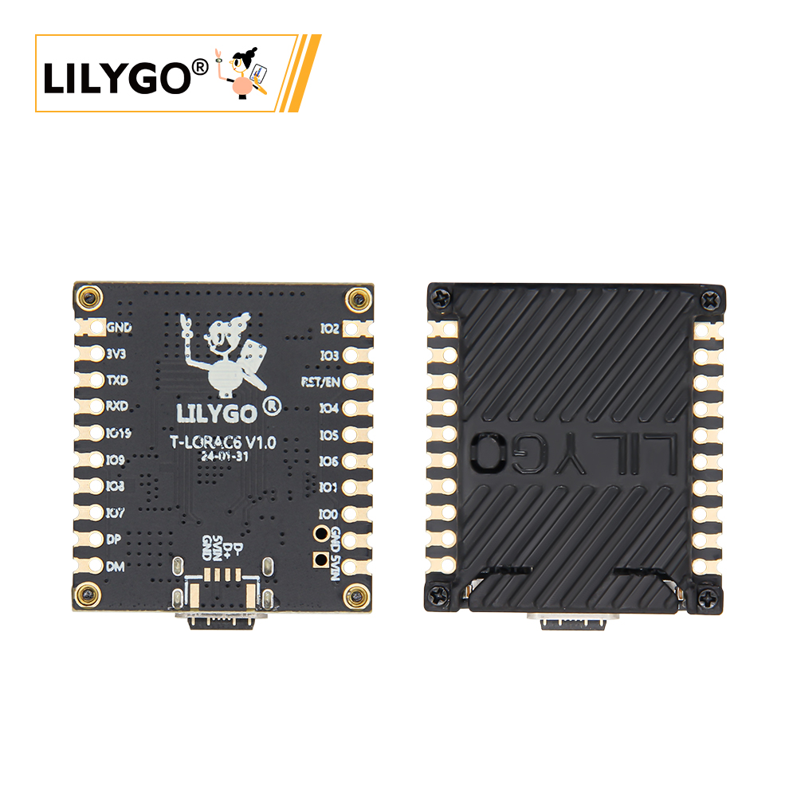
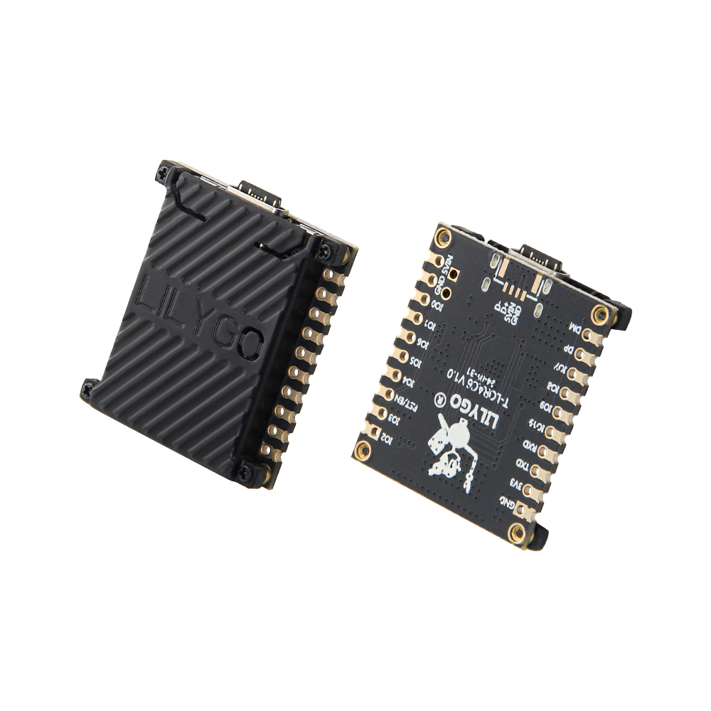
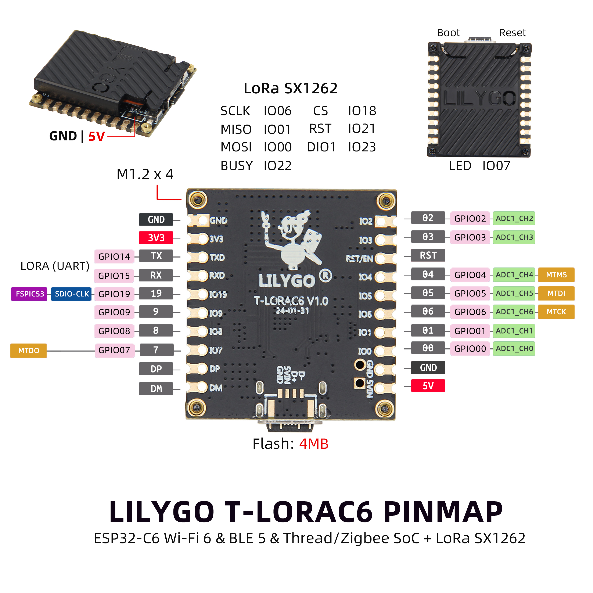
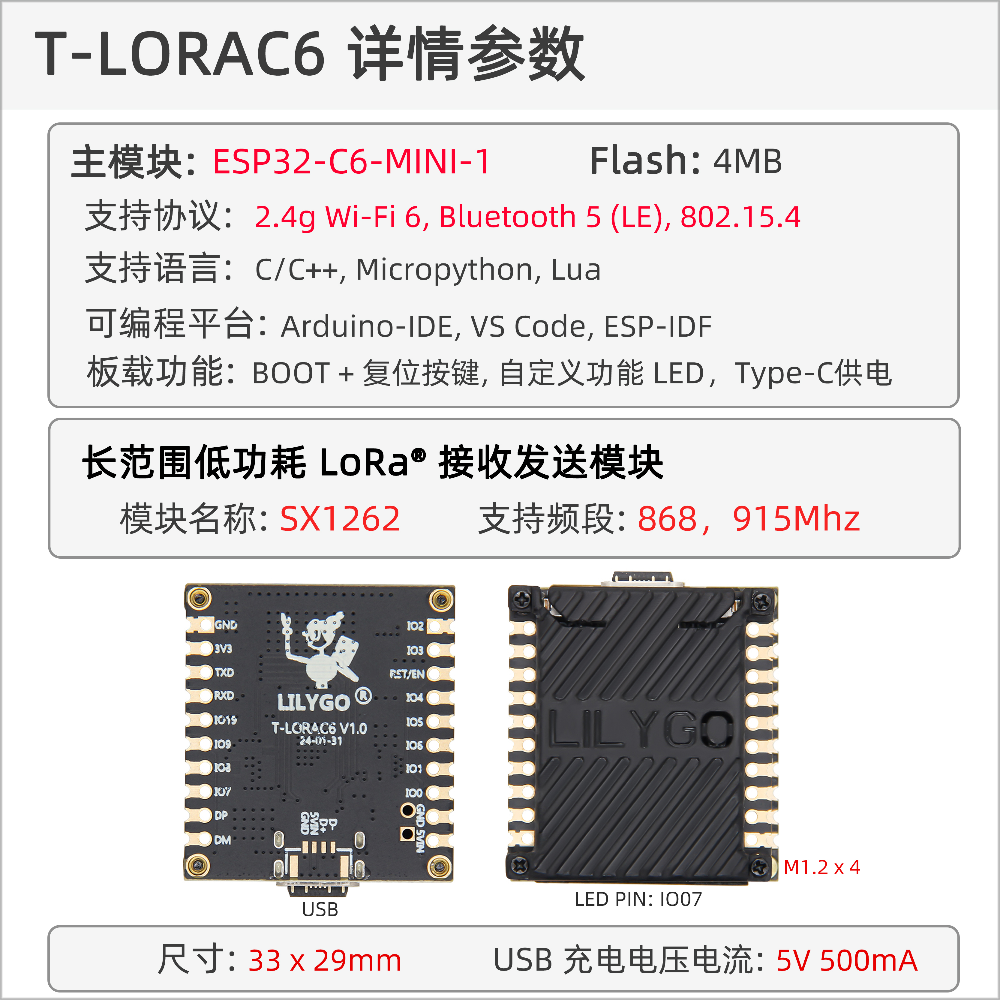

<!-- **[English](README.MD) | 中文** -->

    <a target="_blank" style="margin: 1em;color: white; font-size: 0.9em; border-radius: 0.3em; padding: 0.5em 2em; background-color:rgb(103, 175, 8)" href="https://lilygo.cc/products/t-lora-c6">官网购买</a>
    <!-- <a target="_blank" style="margin: 1em;color: white; font-size: 0.9em; border-radius: 0.3em; padding: 0.5em 2em; background-color:rgb(63, 201, 28)" href="https://www.aliexpress.com/store/911876460">速卖通</a> -->

## 简介

LILYGO T-LoRaC6 是一款基于 ESP32-C6-MINI-1 模组的紧凑型物联网开发板，集成 2.4GHz Wi-Fi 6、蓝牙 5（LE） 及 LoRa® 远距离通信（SX1262 模块，支持 868/915MHz 频段），兼具高性能与低功耗特性。板载 4MB Flash，支持 C/C++、MicroPython、Lua 多语言开发，适配 Arduino-IDE、VS Code 和 ESP-IDF 等主流平台，提供 BOOT/复位按键、自定义 LED 及 Type-C 供电接口，便于快速调试与部署。其小巧尺寸（33x29mm）与多协议融合能力（Wi-Fi/蓝牙/LoRa）使其适用于智能家居控制、工业传感器网络、远程环境监测等场景，5V 500mA 供电设计进一步简化了移动设备集成，是低功耗广域物联网应用的理想选择。

## 外观及功能介绍
### 外观

### 引脚图  

## 模块资料
### 概述

| 组件 | 描述 |
| --- | --- |
| MCU | ESP32-C6-MINI-1 
| FLASH| 4MB(Quad-SPI) |
| LoRa | SX1262: 868, 915Mhz
| 无线 | 2.4g Wi-Fi 6, Bluetooth 5 (LE), 802.15.4
| USB | 1 × USB Port and OTG(TYPE-C接口) |
| 拓展接口 |  2 × 10-PIN GPIO 接口|
| 按键 | 1 x RESET 按键 + 1 x BOOT 按键  |
| 电源输入 | 5V/500mA |
| 孔位 | **4 × M1.2 定位孔** |
| 尺寸 |**33 X 29 X 6 mm**  |

### 相关资料链接

Github:[T-LoRa-C6](https://github.com/Xinyuan-LilyGO/LilyGo-LoRa-Series)

#### 原理图

[T-LoRa-C6](https://github.com/Xinyuan-LilyGO/LilyGo-LoRa-Series/blob/master/schematic/T3-C6_V1.0.pdf)

#### 依赖库

- [AXP202](https://github.com/lewisxhe/AXP202X_Library)
- [AceButton](https://github.com/bxparks/AceButton)
- [Arduino_GFX](https://github.com/moononournation/Arduino_GFX)
- [Adafruit_BME280_Library](https://github.com/adafruit/Adafruit_BME280_Library)
- [Adafruit_BusIO](https://github.com/adafruit/Adafruit_BusIO)
- [Adafruit_Sensor](https://github.com/adafruit/Adafruit_Sensor)
- [ESP8266_SSD1306](https://github.com/ThingPulse/esp8266-oled-ssd1306)
- [GxEPD](https://github.com/ZinggJM/GxEPD)
- [LMIC-Arduino](https://github.com/matthijskooijman/LMIC-node)
- [LoRa](https://github.com/sandeepmistry/arduino-LoRa)
- [RadioLib](https://github.com/jgromes/RadioLib)
- [TFT_eSPI](https://github.com/Bodmer/TFT_eSPI)
- [TinyGPSPlus](https://github.com/mikalhart/TinyGPSPlus)
- [TinyGSM](https://github.com/vshymanskyy/TinyGSM)
- [U8g2](https://github.com/olikraus/u8g2)

## 软件开发
### Arduino 设置参数

| Board                                | ESP32C6 Dev Module                                   |
|--------------------------------------|------------------------------------------------------|
| Port                                 | Your port                                            |
| USB CDC On Boot                      | Enable                                               |
| CPU Frequency                        | 160MHZ(WiFi)                                         |
| Core Debug Level                     | None                                                 |
| USB DFU On Boot                      | Disable                                              |
| Erase All Flash Before Sketch Upload | Disable                                              |
| Flash Mode                           | DIO                                                  |
| Flash Size                           | 4MB(32Mb)                                            |
| Arduino Runs On                      | Core1                                                |
| USB Firmware MSC On Boot             | Disable                                              |
| Partition Scheme                     | Default 4M Flash with spiffs(1.2M APP/1.5MB SPIFFS)  |
| Upload Speed                         | 921600                                               |
| Programmer                           | Esptool                                              |

### 开发平台
1. [VS Code](https://code.visualstudio.com/)
2. [Arduino IDE](https://www.arduino.cc/en/software)
3. [Platform IO](https://platformio.org/)
4. [MicroPython](https://micropython.org/)
5. [ESP-IDF](https://github.com/espressif/esp-idf)

## 产品技术支持 

