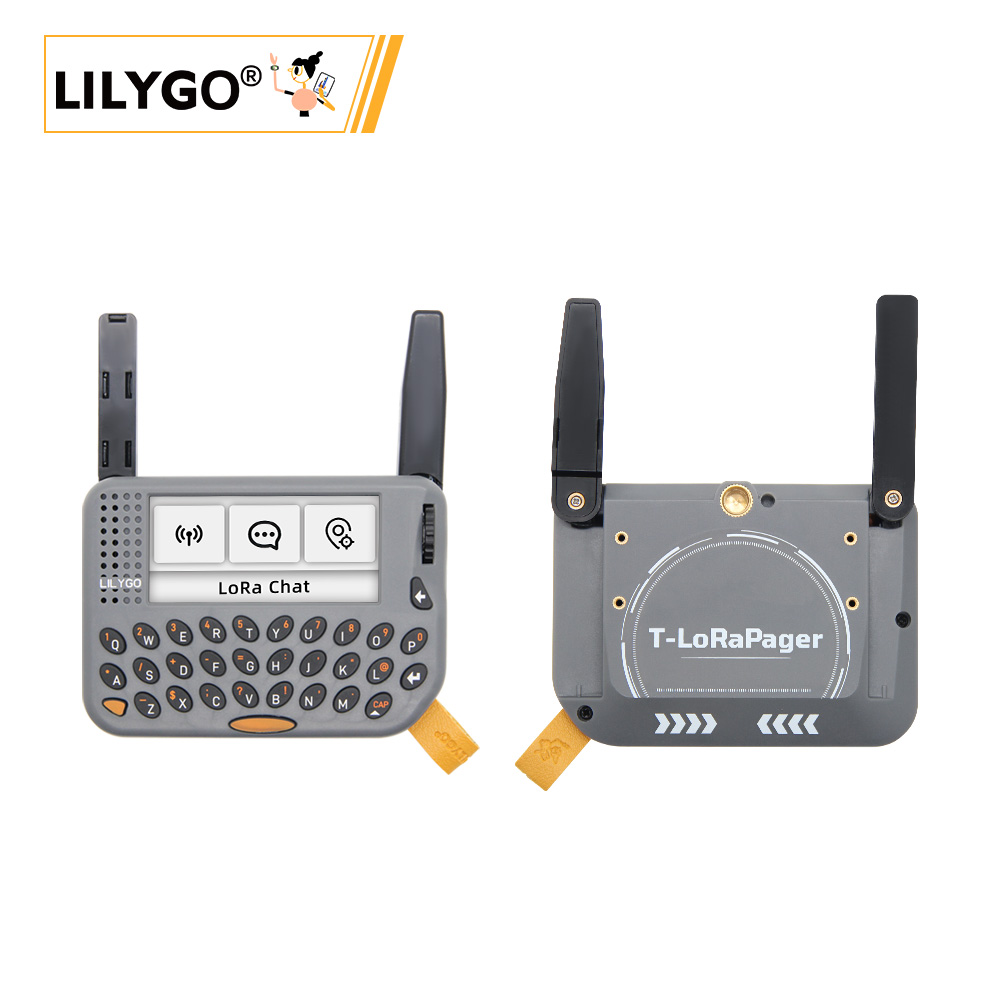
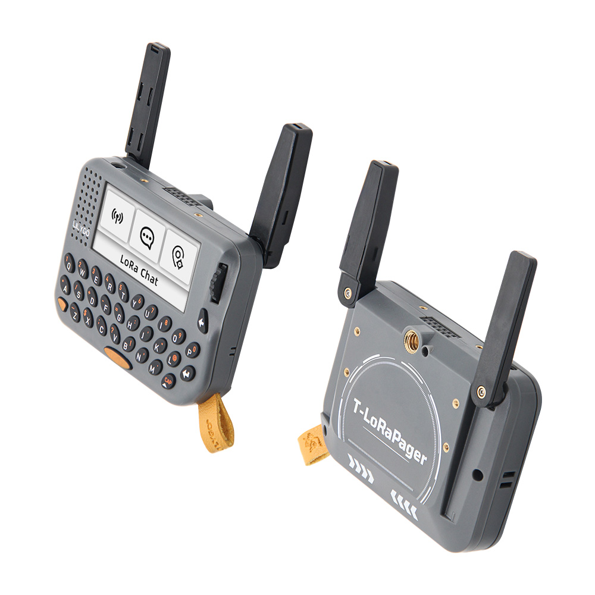

<!-- **[English](README.MD) | 中文** -->

    <a target="_blank" style="margin: 1em;color: white; font-size: 0.9em; border-radius: 0.3em; padding: 0.5em 2em; background-color:rgb(103, 175, 8)" href="https://lilygo.cc/products/t-lora-pager">官网购买</a>
    <!-- <a target="_blank" style="margin: 1em;color: white; font-size: 0.9em; border-radius: 0.3em; padding: 0.5em 2em; background-color:rgb(63, 201, 28)" href="https://www.aliexpress.com/store/911876460">速卖通</a> -->

## 简介

T-LoraPager 是一款LILYGO Lora+ESP32-S3的手持AIOT可编程开发设备的新型号，特点是小巧的外观+可折叠外部天线设计，即能充分发挥出无线性能的同时保持美观的设计。
 T-LoraPager 有多种版本规格可选，外观结构不变，主要区别是LoRa 型号不同，对应的有LR1121版本和SX1262版本，还有一个用CC1101替代Lora功能版本，根据你的应用需求可以选购不同版本。
 内部集成了丰富的功能：
- QWERT键盘
- 支持AI 的IMU（BHI260AP）
- 2.33寸长条屏（分辨率为222X480）
- 可选的LoRa（LR1121或者SX1262）
- U-blox GPS模组（MIA-M10Q）
- RFID/NFC+RTC电路
- TI的电源管理监控芯片组合+
- ES8311（麦克风/扬声器/耳机座）
- 编码器带按键
- 2 x 8GPIO扩展接口（为了产品顶部适配扩展NRF24L01模块）
- 背部的1/4固定螺丝接口
- 4 x M2螺丝柱
- 带LILYGO logo的挂绳。
出厂固件带有LILYGO设计的UI Demo通过编码器拨动进行流畅交互。基于demo你可以学习开发不同的应用场景程序。

## 外观及功能介绍
### 外观

### 引脚图 

### 三视图

## 模块资料以及参数
### 开发板参数

| 组件 | 描述 |
| ---  | --- |
|MCU	|ESP32-S3
|Flash 	|16M 
|PSRAM  |8M
|Lora|	SX1262 433Mhz~920Mhz(可选)
|GPS	|MIA-M10Q
|无线| 2.4 GHz Wi-Fi & Bluetooth 5 (LE)
|NFC | ST25R3916(SPI) |
|存储| TF卡
|屏幕| ST7796 480 x 222 LCD
|AI智能传感器 |	BHI260AP
|GNSS	| 低功耗GNSS模块(可并发数:4)
|输入|  键盘
|编码器|   旋转编码器
|RTC	|支持电源开关
|触摸	|GT911
|按键 | 1 x RST 按键 + 1 x BOOT 按键  |
|音频解码器	|RC01812(24-bit , 8kHz ~ 96kHz)
| USB |1 × type-C接口|
|IO 拓展	|PCA9535PW (0x20)
| 拓展接口 | GPS拓展接口 + 2 × Knockout(用于拓展天线的AUX连接器) +2.54mm 2*8 拓展IO接口(针对NRF24L01模块) |
| 孔位 | 1/4英寸固定螺丝接口 + 4 x M2*2.5 背孔|
| 电源输入 | 5V/500mA |
| 尺寸 | **106x89x23mm**  |

### 相关资料
Github：[T-LoraPager](https://github.com/Xinyuan-LilyGO/LilyGoLib?tab=readme-ov-file)
软件说明: [T-LoraPager](https://github.com/Xinyuan-LilyGO/LilyGoLib/blob/master/docs/lilygo-t-lora-pager.md)
硬件说明: [T-LoraPager](https://github.com/Xinyuan-LilyGO/LilyGoLib/blob/master/docs/hardware/lilygo-t-lora-pager.md)

#### 原理图

[T-LoraPager](https://github.com/Xinyuan-LilyGO/LilyGoLib/blob/master/docs/hardware/schematic.pdf)

<!-- * [SY6970](./datasheet/AN_SY6970.pdf) -->

#### 依赖库

* [LilyGoLib](https://github.com/Xinyuan-LilyGO/LilyGoLib)

## 软件开发
### Arduino 设置参数

| Arduino IDE Setting                  | Value                          |
|--------------------------------------|--------------------------------|
| Board                                | LilyGo-T-LoRa-Pager            |
| Port                                 | Your port                      |
| USB CDC On Boot                      | Enabled                        |
| CPU Frequency                        | 240MHZ(WiFi)                   |
| Core Debug Level                     | None                           |
| USB DFU On Boot                      | Disable                        |
| Erase All Flash Before Sketch Upload | Disable                        |
| Events Run On                        | Core 1                         |
| JTAG Adapter                         | Disable                        |
| Arduino Runs On                      | Core 1                         |
| USB Firmware MSC On Boot             | Disable                        |
| Partition Scheme                     | 16M Flash(3M APP/9.9MB FATFS)  |
| Board Revision                       | Radio-SX1262                   |
| Upload Mode                          | UART0/Hardware CDC             |
| Upload Speed                         | 921600                         |
| USB Mode                             | CDC and JTAG                   |

### 开发平台
1. [VS Code](https://code.visualstudio.com/)
2. [Arduino IDE](https://www.arduino.cc/en/software)
3. [Platform IO](https://platformio.org/)
4. [Micropython](https://micropython.org/)

## 产品技术支持 

