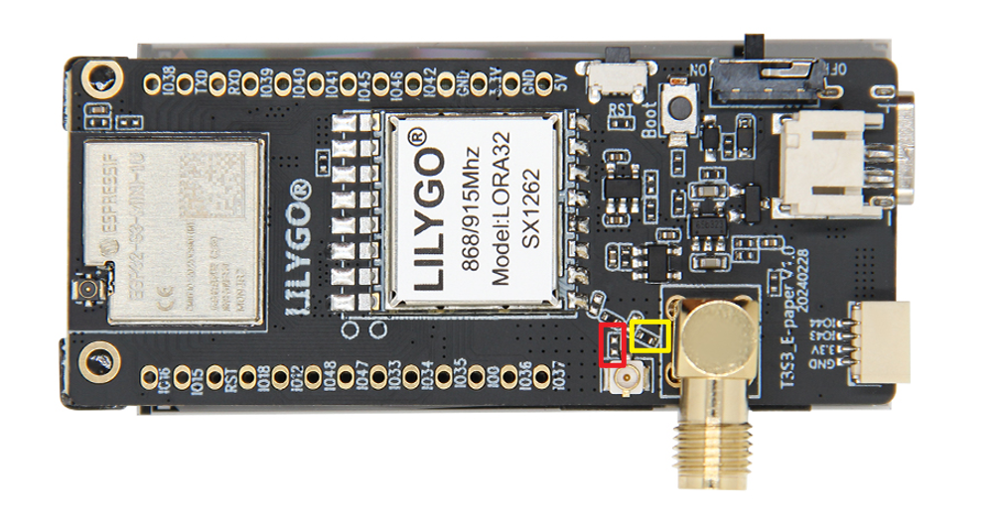

<!-- **[English](README.MD) | 中文** -->

    <a target="_blank" style="margin: 1em;color: white; font-size: 0.9em; border-radius: 0.3em; padding: 0.5em 2em; background-color:rgb(63, 201, 28)" href="https://lilygo.cc/products/ts-s3-epaper">官方购买</a>
    <!-- <a target="_blank" style="margin: 1em;color: white; font-size: 0.9em; border-radius: 0.3em; padding: 0.5em 2em; background-color:rgb(63, 201, 28)" href="https://www.aliexpress.com/store/911876460">速卖通</a> -->

## 简介

T3-S3 E-Paper 是一款基于 ESP32S3FH4R2 微控制器的低功耗物联网开发板，集成 2.4GHz Wi-Fi 和蓝牙 5.0 双模无线通信，并支持多种 LoRa 射频模块（包括 SX1280、SX1276、SX1262），覆盖 2.4GHz 及 868/915MHz 频段，适用于远距离低功耗数据传输场景。其核心搭载 2.13 英寸电子墨水屏（DEPG0213BN），分辨率为 250×122，屏幕尺寸紧凑（48.55×23.70mm），兼具低功耗与高可视性，适合信息静态显示需求（如电子标签、环境监测）。硬件配置包括 4MB Flash 和 2MB PSRAM，支持 SD 卡扩展存储，并提供 USB 或 3.7V 锂电池双供电（带电池开关），满足移动设备长续航需求。板载 Reset/Boot 按键、多频段天线（板载+外置）及紧凑机身设计（67×29mm），使其在智慧农业、工业传感、智能仓储等领域具有广泛适用性。

## 外观及功能介绍
### 外观

### 引脚图 

## 模块资料以及参数
### 概述

| 组件 | 描述 |
| --- | --- |
| MCU | ESP32S3FH4R2 |
| FLASH| 4MB |
| PSRAM | 2MB|
| 屏幕 | 2.13 英寸 DEPG0213BN E-Paper 电子墨水屏 |
| LoRa | SX1280:2.4Ghz SX1276:868/915Mhz SX1262:868/915MHz |
| 存储 | TF 卡 |
| 无线 |2.4 GHz Wi-Fi & Bluetooth5 (LE)
| USB | 1 × USB Port and OTG(TYPE-C接口) |
| IO 接口 | 2.54mm间距 2*13（双排）拓展IO接口 |
| 拓展接口| 1 × FPC 天线拓展接口 +1 × TF card接口  + 1 × STEMMA QT/QWIIC接口(JST-SH 1.0MM 4Pin)  + JST-GH 2MM 接口|
| 按键 | 1 x RESET 按键 + 1 x BOOT 按键|
| 孔位 | **2mm定位孔 * 4** |
| 尺寸 | **67x29x15mm**  |

### 相关资料

Github：[T3-S3-E-paper](https://github.com/Xinyuan-LilyGO/Lilygo-LoRa-Epaper-series/tree/master)

#### 原理图

[T3-S3-E-paper](https://github.com/Xinyuan-LilyGO/Lilygo-LoRa-Epaper-series/blob/master/schematic/T3S3_E-paper%20V1.0%2023-12-16.pdf)

<!-- * [SY6970](./datasheet/AN_SY6970.pdf) -->

#### 依赖库

* [Adafruit-GFX-Library](https://github.com/adafruit/Adafruit-GFX-Library)
* [GxEPD](https://github.com/bot1131357/GxEPD)
* [RadioLib](https://github.com/jgromes/RadioLib)
* [SensorLib](https://github.com/lewisxhe/SensorsLib)

#### 注意事项

> 使用者如有需要调节外接天线电阻请参考

>!调整电阻方向实现调节外接天线的电阻。

## 软件开发
### Arduino 设置参数

| Setting                  | Value                            |
|--------------------------|----------------------------------|
| Board                    | ESP32S3 Dev Module               |
| Upload Speed             | 921600                           |
| USB Mode                 | Hardware CDC and JTAG            |
| USB CDC On Boot          | Enabled                          |
| USB Firmware MSC On Boot | Disabled                         |
| USB DFU On Boot          | Disabled                         |
| CPU Frequency            | 240MHz (WiFi)                    |
| Flash Mode               | QIO 80MHz                        |
| Flash Size               | 4MB (32Mb)                       |
| Core Debug Level         | None                             |
| Partition Scheme         | Default 4MB with spiffs          |
| PSRAM                    | OPI PSRAM                        |
| Arduino Runs On          | Core 1                           |
| Events Run On            | Core 1                           |

### 开发平台
1. [Micropython](https://micropython.org/)
2. [Arduino IDE](https://www.arduino.cc/en/software)
3. [Platform IO](https://platformio.org/)

## 产品技术支持 

