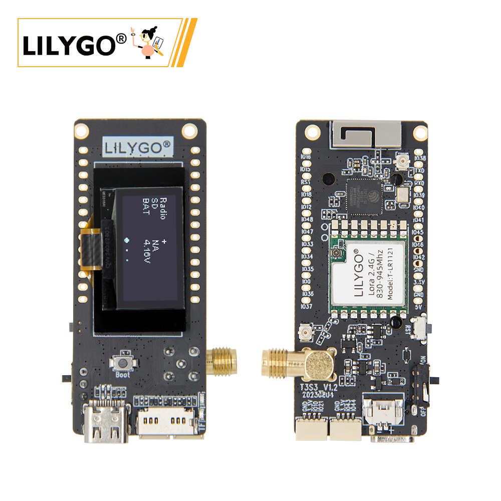
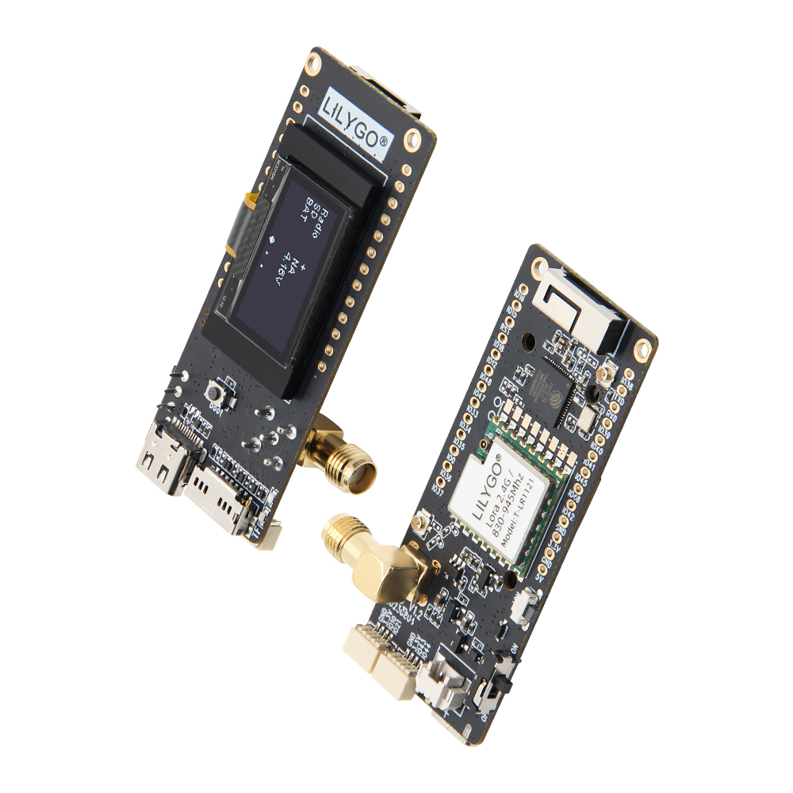
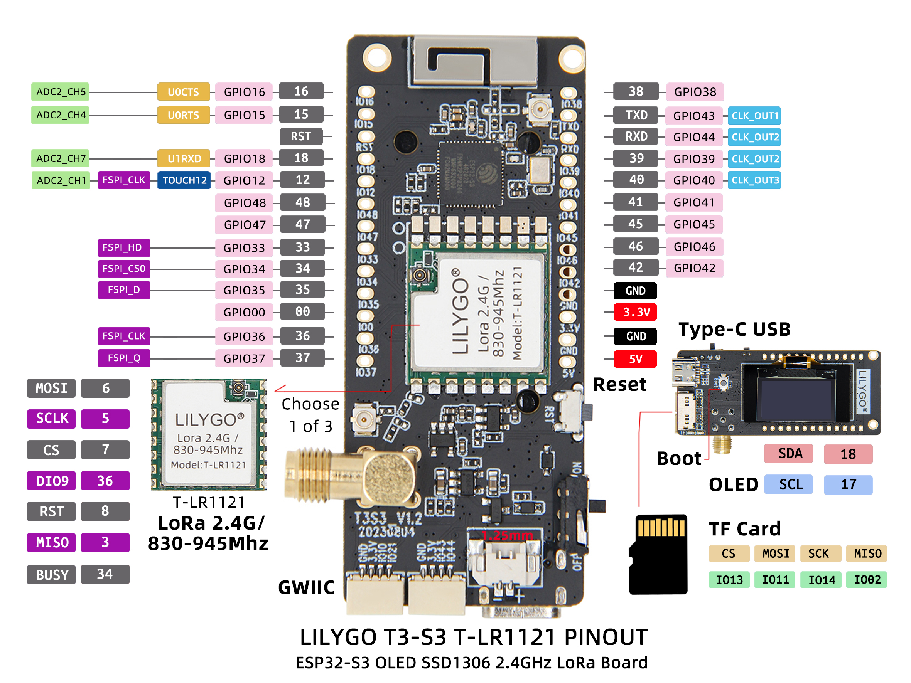
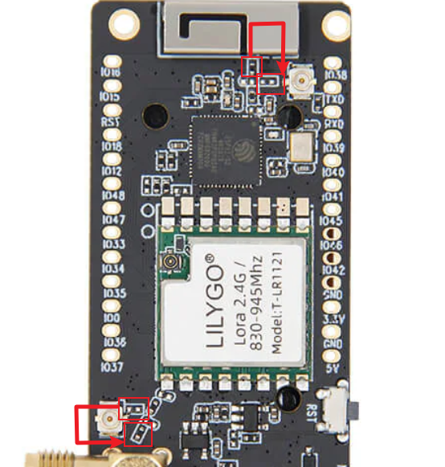

<!-- **[English](README.MD) | 中文** -->

<!-- 

    <a target="_blank" style="margin: 1em;color: white; font-size: 0.9em; border-radius: 0.3em; padding: 0.5em 2em; background-color:rgb(63, 201, 28)" href="https://item.taobao.com/item.htm?id=846226367137">淘宝</a>
    <a target="_blank" style="margin: 1em;color: white; font-size: 0.9em; border-radius: 0.3em; padding: 0.5em 2em; background-color:rgb(63, 201, 28)" href="https://www.aliexpress.com/store/911876460">速卖通</a>

 -->

## 简介

LILYGO T3-S3 LR1121 是一款基于 ESP32-S3 的高集成物联网开发板，支持 2.4GHz 与 830-945MHz 双频段 LoRa 通信，覆盖远距离传输需求（10km+），兼容全球不同地区频谱规范。板载 1.3 英寸 OLED 屏实时显示数据，配备 TF 卡槽扩展存储，Type-C 接口简化供电与调试。提供丰富 GPIO 引脚（支持 ADC、SPI、I2C 等协议），可灵活连接传感器或外设，结合 Wi-Fi/蓝牙 5.0 实现多协议互联。适用于智慧农业监测、工业设备管理、应急通信组网及智能家居网关等场景，兼顾低功耗设计与紧凑结构，是高效搭建物联网系统的理想硬件平台。

## 外观及功能介绍
### 外观

### 引脚图 

## 模块资料
### 概述

| 组件 | 描述 |
| --- | --- |
| MCU | ESP32S3FH4R2
| FLASH| 4MB |
| PSRAM | 2MB|
| RTC | PCF85063ATL (IIC)|
| LoRa | 830~945Mhz 2.4Ghz |
| 存储 | TF 卡 |
| 无线 |2.4Ghz Wi-Fi + Bluetooth 5.0
| USB | 1 × USB Port and OTG(TYPE-C接口) |
| IO 接口 | 2.54mm间距 × 2*20（双排）拓展IO接口 |
| 按键 | 1 x RESET 按键 + 1 x BOOT 按键|
| 拓展接口| 2 × QWIIC接口 |
| 屏幕 | OLED(IIC)|
| 电池接口 |1.25mm 电池接口 |
| 电源 | 5V/500mA |
| 孔位 | **2mm定位孔 *2** |
| 尺寸 | **66x27x15mm**  |

### 相关资料链接

Github:[T3-S3 LR1121](https://github.com/Xinyuan-LilyGO/LilyGo-LoRa-Series)

- [LR1121](https://www.semtech.com/products/wireless-rf/lora-connect/lr1121)

#### 原理图

[T3-S3 LR1121](https://github.com/Xinyuan-LilyGO/LilyGo-LoRa-Series/blob/master/schematic/T3_S3_V1.3.pdf)

#### 依赖库

- [u8g2](https://github.com/olikraus/u8g2)
- [XPowersLib](https://github.com/lewisxhe/XPowersLib)
- [LoRa](https://github.com/sandeepmistry/arduino-LoRa)

#### 注意事项

> 使用者如有需要调节外接天线电阻请参考

>!调整电阻方向实现调节外接天线的电阻。

## 软件开发
### Arduino 设置参数

| T3-S3 V.1x                           | Value                             |
|--------------------------------------|-----------------------------------|
| Board                                | ESP32S3 Dev Module                |
| Port                                 | Your port                         |
| USB CDC On Boot                      | Enable                            |
| CPU Frequency                        | 240MHZ(WiFi)                      |
| Core Debug Level                     | None                              |
| USB DFU On Boot                      | Disable                           |
| Erase All Flash Before Sketch Upload | Disable                           |
| Events Run On                        | Core1                             |
| Flash Mode                           | QIO 80MHZ                         |
| Flash Size                           | 4MB(32Mb)                         |
| Arduino Runs On                      | Core1                             |
| USB Firmware MSC On Boot             | Disable                           |
| Partition Scheme                     | Huge APP (3MB No OTA/1MB SPIFFS)  |
| PSRAM                                | QSPI PSRAM                        |
| Upload Mode                          | UART0/Hardware CDC                |
| Upload Speed                         | 921600                            |
| USB Mode                             | CDC and JTAG                      |
| Programmer                           | Esptool                           |
      

### 开发平台

1. [VS Code](https://code.visualstudio.com/)
2. [Arduino IDE](https://www.arduino.cc/en/software)
3. [Platform IO](https://platformio.org/)

## 产品技术支持 

