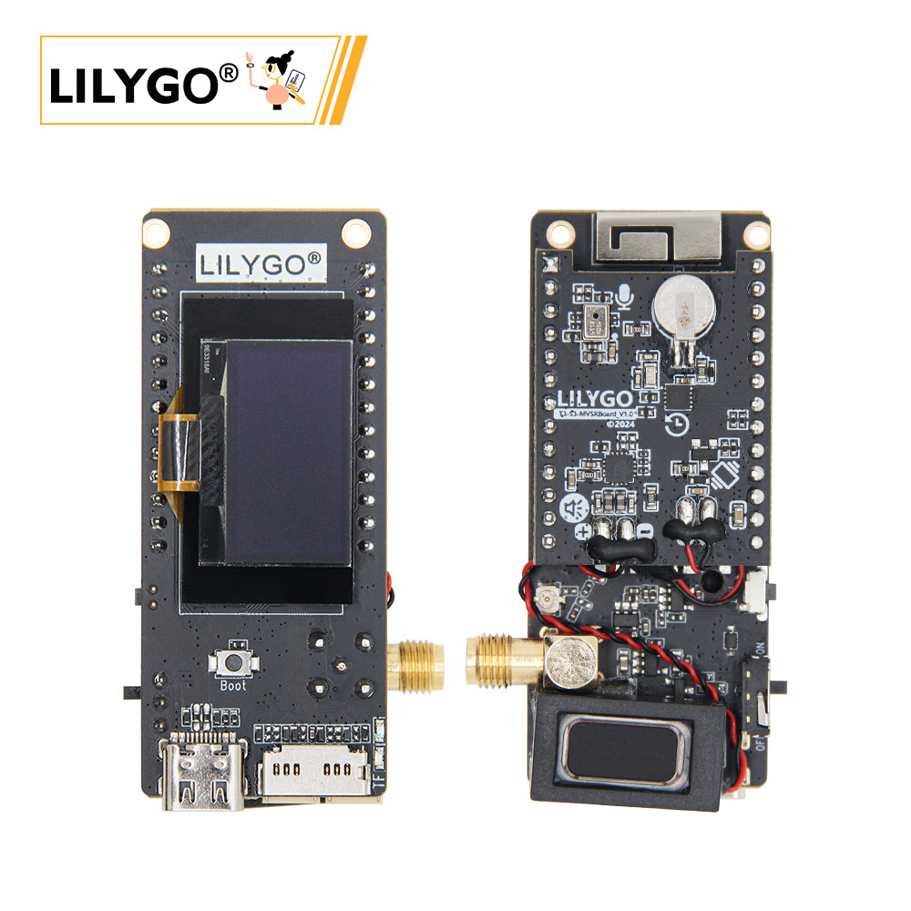

<!-- **[English](README.MD) | 中文** -->

<!-- 

    <a target="_blank" style="margin: 1em;color: white; font-size: 0.9em; border-radius: 0.3em; padding: 0.5em 2em; background-color:rgb(63, 201, 28)" href="https://item.taobao.com/item.htm?id=846226367137">淘宝</a>
    <a target="_blank" style="margin: 1em;color: white; font-size: 0.9em; border-radius: 0.3em; padding: 0.5em 2em; background-color:rgb(63, 201, 28)" href="https://www.aliexpress.com/store/911876460">速卖通</a>

 -->

## 简介

 T3-S3 MVSR版本是基于T3-S3主板设计了带有震动马达，麦克风，扬声器，RTC功能扩展模块的版本，这个版本的主要功能应用是用于lora 语音收发功能。
 这个扩展版本目前支持T3S3的SX1262和SX1280两个型号主板。
 SX1262版本使用的是FSK制式，SX1280使用的是LORA制式。
 在github上有对应的测试Demo供你开发参考使用。
 当然，这个扩展版本还可以用于一些AI语音交互功能，或者MP3播放等。

## 外观及功能介绍
### 外观

### 引脚图 

## 模块资料
### 概述
T3-S3-MVSRBoard 是针对 T3-S3_V1.2 主板的背板设计，具有板载扬声器和麦克风扩展功能，静态电流极低。此外，它还包含振动和 RTC（实时时钟）功能

| 组件 | 描述 |
| --- | --- |
| MCU | ESP32S3FH4R2
| FLASH| 4MB |
| PS RAM | 2MB|
| RTC | PCF85063ATL (IIC)|
| 麦克风 | MP34DT05-A (PDM)|
| 语音 | MAX98357A (IIS) |
| LoRa | SX1262:868、915Mhz SX1280:2.4Ghz |
| 存储 | TF 卡 |
| 无线 |2.4Ghz Wi-Fi + Bluetooth 5.0
| USB | 1 × USB Port and OTG(TYPE-C接口) |
| IO 接口 | 2.54mm间距 × 2*20（双排）拓展IO接口 |
| 按键 | 1 x RESET 按键 + 1 x BOOT 按键(内置) |
| 屏幕 | OLED(IIC)|
| 电源 | 5V/500mA |
| 孔位 | **2mm定位孔 *2** |
| 尺寸 | **66x27x15mm**  |
### 相关资料链接

Github:[T3-S3-MBSRBoard](https://github.com/Xinyuan-LilyGO/T3-S3-MVSRBoard)

- [MAX98357A](https://github.com/Xinyuan-LilyGO/T3-S3-MVSRBoard/blob/main/information/MAX98357AETE+T.pdf)
- [MSM261S4030H0R](https://github.com/Xinyuan-LilyGO/T3-S3-MVSRBoard/blob/main/information/MEMSensing-MSM261S4030H0R.pdf)
- [PCF85063ATL](https://github.com/Xinyuan-LilyGO/T3-S3-MVSRBoard/blob/main/information/PCF85063ATL-1,118.pdf)
- [MP34DT05-A](https://github.com/Xinyuan-LilyGO/T3-S3-MVSRBoard/blob/main/information/mp34dt05-a.pdf)

#### 原理图

[T3-S3-MVSRBoard](https://github.com/Xinyuan-LilyGO/T3-S3-MVSRBoard/blob/main/project/T3-S3-MVSRBoard_V1.0.pdf)

#### 依赖库
- [Speak](https://github.com/Xk-w/Arduino_DriveBus)
- [Microphone](https://github.com/Xk-w/Arduino_DriveBus)
- [RTC](https://github.com/Xk-w/Arduino_DriveBus)

#### 注意事项

> 使用者如有需要调节外接天线电阻请参考

>!箭头处指向处可更换电阻实现调整外接天线的电阻

## 软件开发
### Arduino 设置参数

| Setting                               | Value                                 |
| ------------------------------- | ------------------------------- |
| Board                                 | ESP32S3 Dev Module           |
| Upload Speed                     | 921600                               |
| USB Mode                           | Hardware CDC and JTAG     |
| USB CDC On Boot                | Enabled                              |
| USB Firmware MSC On Boot | Disabled                             |
| USB DFU On Boot                | Disabled                             |
| CPU Frequency                   | 240MHz (WiFi)                    |
| Flash Mode                         | QIO 80MHz                         |
| Flash Size                           | 16MB (128Mb)                    |
| Core Debug Level                | None                                 |
| Partition Scheme                | 16M Flash (3MB APP/9.9MB FATFS) |
| PSRAM                                | OPI PSRAM                         |
| Arduino Runs On                  | Core 1                               |
| Events Run On                     | Core 1                               |           

### 开发平台
1. [VS Code](https://code.visualstudio.com/)
2. [Arduino IDE](https://www.arduino.cc/en/software)

## 产品技术支持 

