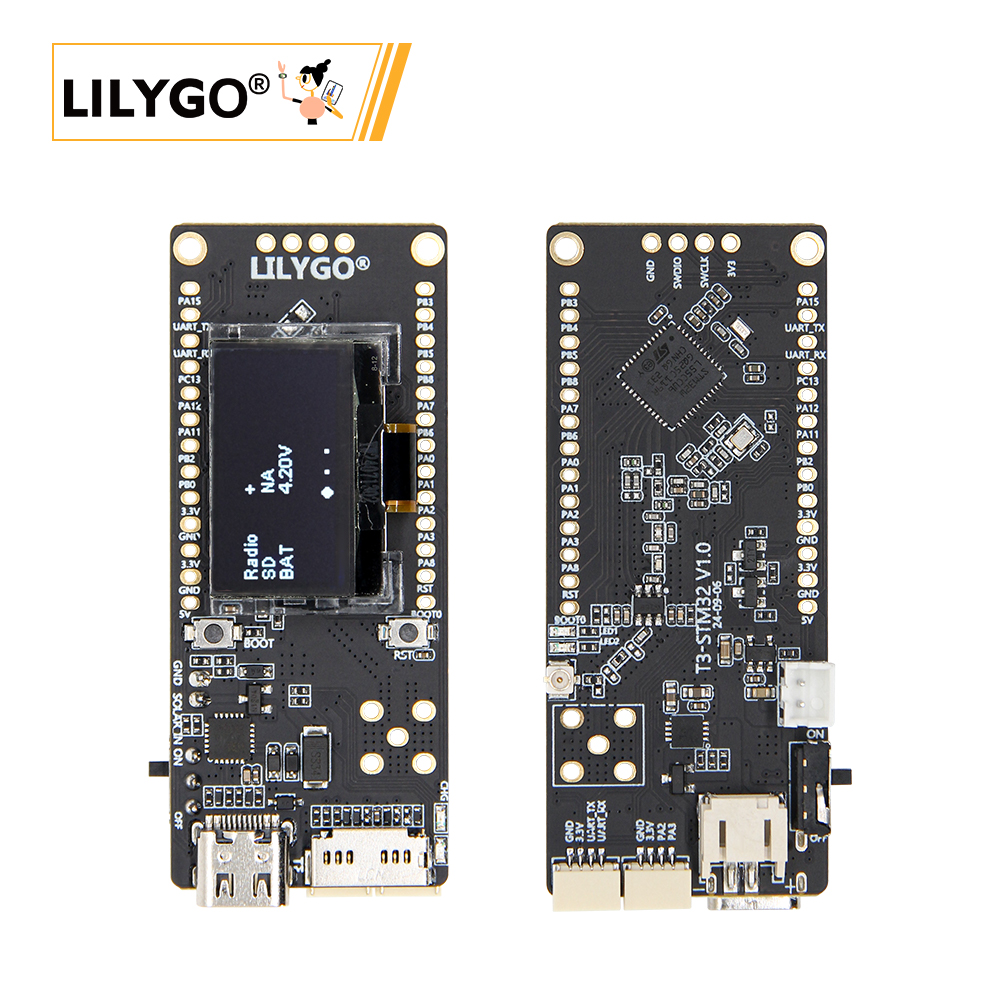
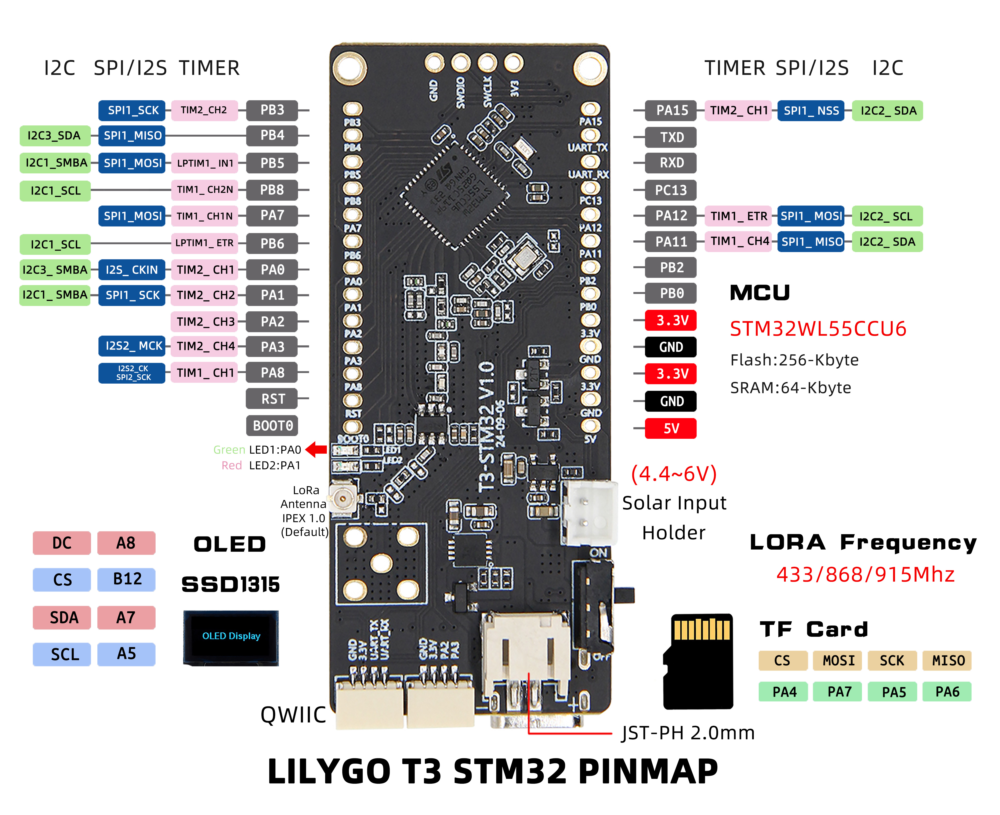
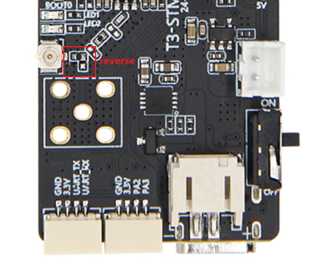

<!-- **[English](README.MD) | 中文** -->

<!-- 

    <a target="_blank" style="margin: 1em;color: white; font-size: 0.9em; border-radius: 0.3em; padding: 0.5em 2em; background-color:rgb(63, 201, 28)" href="https://item.taobao.com/item.htm?id=846226367137">淘宝</a>
    <a target="_blank" style="margin: 1em;color: white; font-size: 0.9em; border-radius: 0.3em; padding: 0.5em 2em; background-color:rgb(63, 201, 28)" href="https://www.aliexpress.com/store/911876460">速卖通</a>

 -->

## 简介

LILYGO T3 STM32 是一款基于 STM32WL55CCU6 低功耗微控制器的多功能物联网开发板，集成 LoRa 远程通信模块，支持 433/868/915MHz 多频段，适配全球物联网应用场景。其硬件配置包括 256KB 闪存与 64KB SRAM，搭载 SSD1315 驱动的 OLED 显示屏（通过 I2C 接口控制）、TF 卡存储扩展（SPI 协议）以及太阳能输入接口（4.4~6V），支持户外能源采集与低功耗运行。板载丰富的 GPIO 引脚，兼容 SPI、I2C、定时器等多种外设接口，并预留 QWIIC 生态连接器，便于传感器扩展。适用于远程监测、环境传感、LoRa 网关及太阳能供电设备等物联网终端的快速开发。

## 外观及功能介绍
### 外观

### 引脚图 

## 模块资料以及参数
### 开发板参数

| 组件 | 描述 |
| ---  | --- |
|MCU	|	STM32WL 55CCU6
|Flash 	|	256kb
|SRAM  |64kb
|Dual Core|32-bit Arm® Cortex®-M4 + Cortex®-M0+ CPU
|内置无线电调制| LoRa®, (G)FSK, (G)MSK ,BPSK
|Lora|	SX1262 433Mhz~915Mhz(可选)
|存储 | TF 卡 |
|屏幕| 0.96 inch SSD1315 Driver I2C OLED
|USB |1 × type-C接口|
|按键 | 1 x RST 按键 + 1 x BOOT 按键  |
|IO 拓展	|2.54mm间距 × 2*13拓展IO接口|
| 拓展接口 |2 × QWIIC 拓展接口  1 × battery Switch  1 × 2.54mm间距 四针拓展SWD接口  1 ×太阳能输入接口(4.4~6V)   1 × LoRa 天线接口   1 ×五针天线座子接口 |
| 孔位 | 2×2mm 定位孔 |
| 尺寸 | **66x27x13mm**  |
### 相关资料

更多项目信息可参考
Github：[T3 STM32](https://github.com/Xinyuan-LilyGO/T3-STM32/tree/master)
* [SSD1315](https://github.com/Xinyuan-LilyGO/T3-STM32/blob/master/hardware/SSD1315.pdf)
#### 原理图

[T3 STM32](https://github.com/Xinyuan-LilyGO/T3-STM32/blob/master/hardware/T3_STM32%20V1.0%2024-07-30.pdf)

<!-- * [SY6970](./datasheet/AN_SY6970.pdf) -->

#### 依赖库

* [STM32 hal](https://github.com/bxparks/AceButton)
* [STM32CubeMX](https://github.com/moononournation/Arduino_GFX)
#### 注意事项

> 使用者如有需要调节外接天线电阻请参考

>!调整电阻方向实现调节外接天线的电阻。

## 下载工具
1. ST 官方编程软件下载 [STM32CubeProgrammer](https://www.st.com.cn/zh/development-tools/stm32cubeprog.html)
2. JLink 下载 [JLink Software and Documentation Pack](https://www.segger.com/downloads/jlink/#J-LinkSoftwareAndDocumentationPack)
3. STLink 驱动下载 [STLink_V3.0.1_win32](https://www.st.com.cn/zh/development-tools/stsw-link009.html)

> `JLink` `STLink` `STM32CubeProgrammer` 三种下载器均需要使用驱动程序才能正常使用

### 开发平台
1. [VS Code](https://code.visualstudio.com/)
2. [STM32Cube](https://www.st.com.cn/zh/development-tools/stm32cubeide.html#get-software)

## 产品技术支持 

