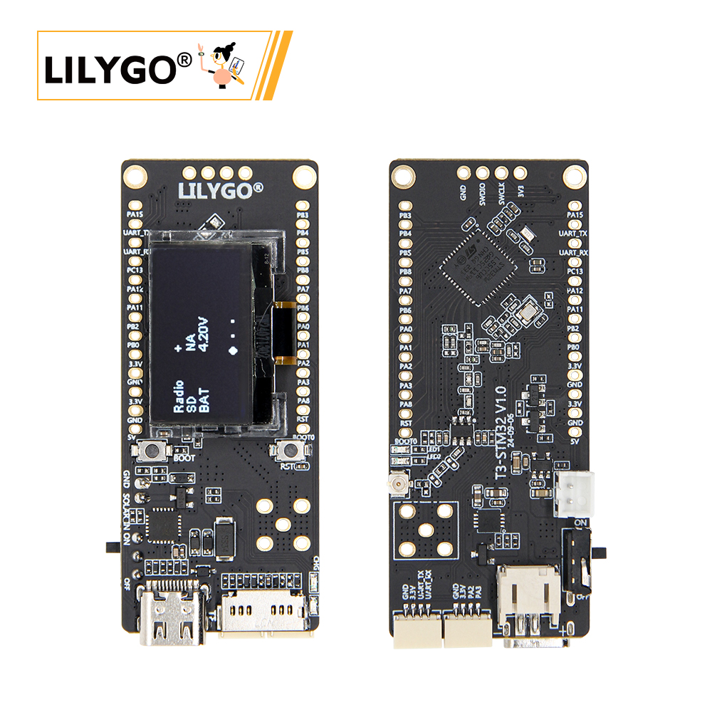
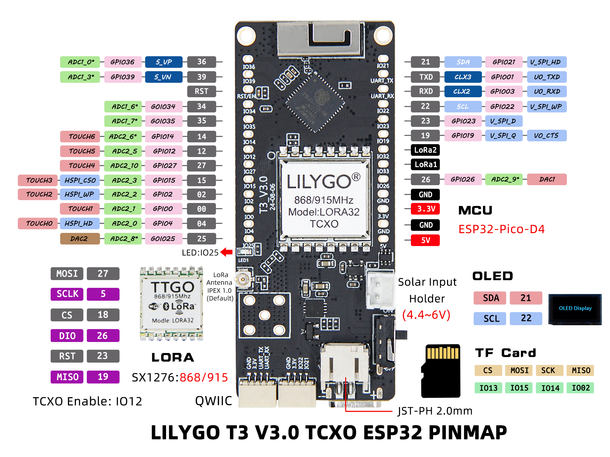
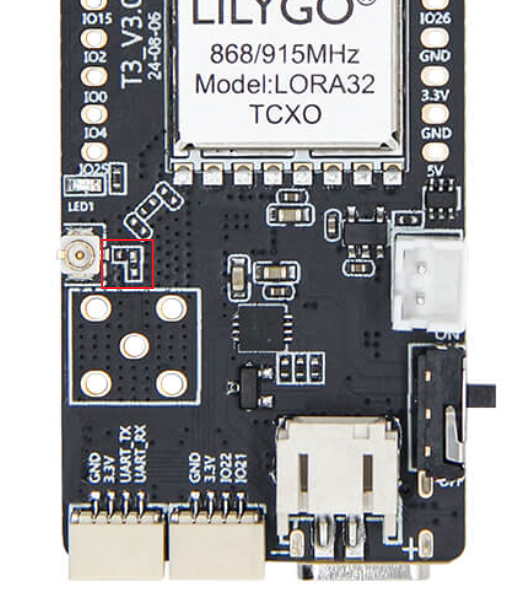

<!-- **[English](README.MD) | 中文** -->

<!-- 

    <a target="_blank" style="margin: 1em;color: white; font-size: 0.9em; border-radius: 0.3em; padding: 0.5em 2em; background-color:rgb(63, 201, 28)" href="https://item.taobao.com/item.htm?id=846226367137">淘宝</a>
    <a target="_blank" style="margin: 1em;color: white; font-size: 0.9em; border-radius: 0.3em; padding: 0.5em 2em; background-color:rgb(63, 201, 28)" href="https://www.aliexpress.com/store/911876460">速卖通</a>

 -->

## 简介

LILYGO LORA32 TCXO 是一款基于 LoRa 技术的无线通信模块，支持 868/915MHz 双频段，适用于全球不同地区的物联网应用。该模块搭载温度补偿晶振（TCXO），显著提升了频率稳定性，适合在温差变化较大的环境中实现高精度通信。其设计集成了 LoRa 调制技术与 32 位微控制器，兼具长距离、低功耗的数据传输与本地处理能力，可广泛应用于智能农业、远程传感器、工业监控等场景。

## 外观及功能介绍
### 外观

### 引脚图 

## 模块资料
### 概述

| 组件 | 描述 |
| --- | --- |
| MCU | ESP32-Pico-D4 |
| FLASH| 4MB |
| PSRAM | 2MB|
| 屏幕 | 1306 IIC驱动 OLED |
| LoRa | 1276:868,915Mhz |
| 存储 | TF 卡 |
| 无线 |Wi-Fi + Bluetooth V4.2+ BLE
| USB | 1 × USB Port and OTG(TYPE-C接口) |
| IO 接口 | 2.54mm间距 2*13（双排）拓展IO接口 |
| 拓展接口| 1 × 天线座子拓展接口 +1 × 天线接口  + 2 × QWIIC接口|
| 按键 | 1 x RESET 按键 + 1 x BOOT 按键|
| 电源 | USB/3.7V 锂电池供电, 电池开关 ,太阳能输入接口|
| 孔位 | **2mm定位孔 *2** |
| 尺寸 | **66x27x13mm**  |
### 相关资料链接

Github:[T3-TXCO](https://github.com/Xinyuan-LilyGO/LilyGo-LoRa-Series)

#### 原理图

[T3-TXCO](https://github.com/Xinyuan-LilyGO/LilyGo-LoRa-Series/blob/master/schematic/T3_V3.0.pdf)

#### 依赖库

- [u8g2](https://github.com/olikraus/u8g2)
- [XPowersLib](https://github.com/lewisxhe/XPowersLib)
- [LoRa](https://github.com/sandeepmistry/arduino-LoRa)

#### 注意事项

> 使用者如有需要调节外接天线电阻请参考

>!调整电阻方向实现调节外接天线的电阻。

## 软件开发
### Arduino 设置参数

|设置  | 参数              |
| --- | --- |
|Board	|ESP32 Dev Module
|Port	|Your port
|CPU Frequency	|240MHZ(WiFi/BT)
|Core Debug Level|	None
|Erase All Flash Before Sketch Upload	|Disable
|Events Run On	|Core1
|Flash Frequency	|80MHZ
|Flash Mode	|QIO
|Flash Size	|4MB(32Mb)
|JTAG Adapter	|Disabled
|Arduino Runs On	|Core1
|Partition Scheme	|Default 4M Flash with spiffs(1.2M APP/1.5MB SPIFFS)
|PSRAM	|Disable
|Upload Speed	|921600
|Programmer	|Esptool

### 开发平台
1. [VS Code](https://code.visualstudio.com/)
2. [Arduino IDE](https://www.arduino.cc/en/software)
3. [Platform IO](https://platformio.org/)

## 产品技术支持 

