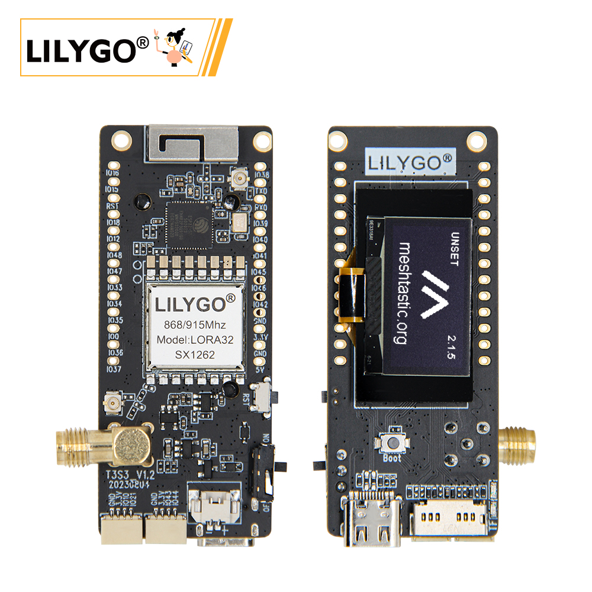

<!-- **[English](README.MD) | 中文** -->

    <a target="_blank" style="margin: 1em;color: white; font-size: 0.9em; border-radius: 0.3em; padding: 0.5em 2em; background-color:rgb(63, 201, 28)" href="https://lilygo.cc/products/t3s3-v1-0?_pos=1&_psq=T3&_ss=e&_v=1.0">官网购买</a>
    <!-- <a target="_blank" style="margin: 1em;color: white; font-size: 0.9em; border-radius: 0.3em; padding: 0.5em 2em; background-color:rgb(63, 201, 28)" href="https://www.aliexpress.com/store/911876460">速卖通</a>-->

 

## 简介

T3S3(LILYGO T3-S3 V1.2 )是一款集成 ESP32-S3 主控与多频段 LoRa 通信能力的开发板，T3S3 可选配 SX1262/76（868/915MHz）或 SX1280（2.4GHz） LoRa 模块，支持远距离低功耗通信；板载 128x64 OLED 显示屏（SSD1306） 及 MicroSD（TF）卡槽，提供数据可视化与存储功能；通过 Type-C USB 实现供电与烧录，并扩展 ADC（GPIO15/16）、UART（U0RTS/U0CTS）、PSP 总线（GPIO33-37） 等丰富接口，同时保留 BOOT/RST 按键与标注清晰的 GPIO 引脚（如 GPIO12/48/47），适用于物联网传感网络、环境监测等低功耗场景开发。

## 外观及功能介绍
### 外观

### 引脚图 

## 模块资料
### 概述

#### 拓展板

| 组件 | 描述 |
| --- | --- |
| MCU | ESP32-S3FH4R2
| FLASH| 	4MB(Quad-SPI) |
| PSRAM | 2MB(Quad-SPI)|
| LoRa | SX1262:433/868/915Mhz SX1276:868/915MhzSX1280:2.4Ghz |
| 屏幕 | 0.96英寸 SSD1306 OLED 屏幕 |
| 存储 | TF 卡 |
| 无线 |2.4Ghz Wi-Fi + Bluetooth 5.0
| USB | 1 × USB Port and OTG(TYPE-C接口) |
| IO 接口 | 2.54mm间距 × 2*13拓展IO接口 |
| 按键 | 1 x RESET 按键 + 1 x BOOT 按键|
| 拓展接口 |  1 x LoRa天线接口 + 1 x 电池接口 + 2 x Qwiic接口 |
| 电源 | 5V/500mA |
| 孔位 | **2mm定位孔 *2** |
| 尺寸 | **66x36x14mm**  |

### 相关资料链接

Github:[T3S3](https://github.com/Xinyuan-LilyGO/LilyGo-LoRa-Series)

- [SX1262 datasheet](https://www.semtech.com/products/wireless-rf/lora-transceivers/sx1262)
- [QMI8658 datasheet](https://github.com/Xinyuan-LilyGO/LilyGo-LoRa-Series/blob/master/lib/SensorsLib/datasheet/QMI8658A%20Datasheet%20Rev1.0.pdf)
- [QMC6310 datasheet](https://github.com/Xinyuan-LilyGO/LilyGo-LoRa-Series/blob/master/lib/SensorsLib/datasheet/QMC6310%20Datasheet%20Rev.C.pdf)
- [CASIC_ProtocolSpecification](https://github.com/Xinyuan-LilyGO/LilyGo-LoRa-Series/blob/master/docs/datasheet/CASIC_ProtocolSpecification.pdf)

#### 原理图

[T3S3](https://github.com/Xinyuan-LilyGO/LilyGo-LoRa-Series/blob/master/schematic/T3_S3_V1.3.pdf)

#### 依赖库

- [AceButton](https://github.com/bxparks/AceButton)
- [Arduino_GFX](https://github.com/moononournation/Arduino_GFX)
- [Adafruit_BusIO](https://github.com/adafruit/Adafruit_BusIO)
- [Adafruit_Sensor](https://github.com/adafruit/Adafruit_Sensor)
- [ESP8266_SSD1306](https://github.com/ThingPulse/esp8266-oled-ssd1306)
- [GxEPD](https://github.com/ZinggJM/GxEPD)
- [LoRa](https://github.com/sandeepmistry/arduino-LoRa)
- [RadioLib](https://github.com/jgromes/RadioLib)
- [U8g2](https://github.com/olikraus/u8g2)

## 软件开发
### Arduino 设置参数

| T3S3                                 | Value                          |
|--------------------------------------|--------------------------------|
| Board                                | ESP32S3 Dev Module             |
| Port                                 | Your port                      |
| USB CDC On Boot                      | Enable                         |
| CPU Frequency                        | 240MHZ(WiFi)                   |
| Core Debug Level                     | None                           |
| USB DFU On Boot                      | Disable                        |
| Erase All Flash Before Sketch Upload | Disable                        |
| Events Run On                        | Core1                          |
| Flash Mode                           | QIO 80MHZ                      |
| Flash Size                           | 4MB(32Mb)                     |
| Arduino Runs On                      | Core1                          |
| USB Firmware MSC On Boot             | Disable                        |
| Partition Scheme                     | Default 4M Flash with spiffs(1.2M APP/1.5MB SPIFFS)  |
| PSRAM                                | QSPI PSRAM                     |
| Upload Mode                          | UART0/Hardware CDC             |
| Upload Speed                         | 921600                         |
| USB Mode                             | CDC and JTAG                   |
| Programmer                           | Esptool                        |        

### 开发平台
1. [ESP-IDF](https://www.espressif.com/zh-hans/products/sdks/esp-idf)
2. [Arduino IDE](https://www.arduino.cc/en/software)
3. [VS Code](https://code.visualstudio.com/)
4. [Micropython](https://micropython.org/)

## 产品技术支持 

