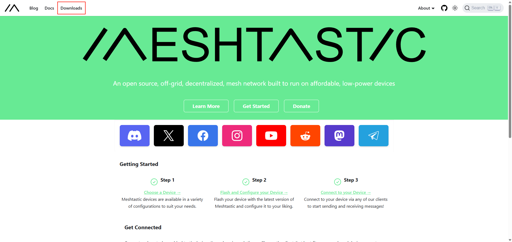
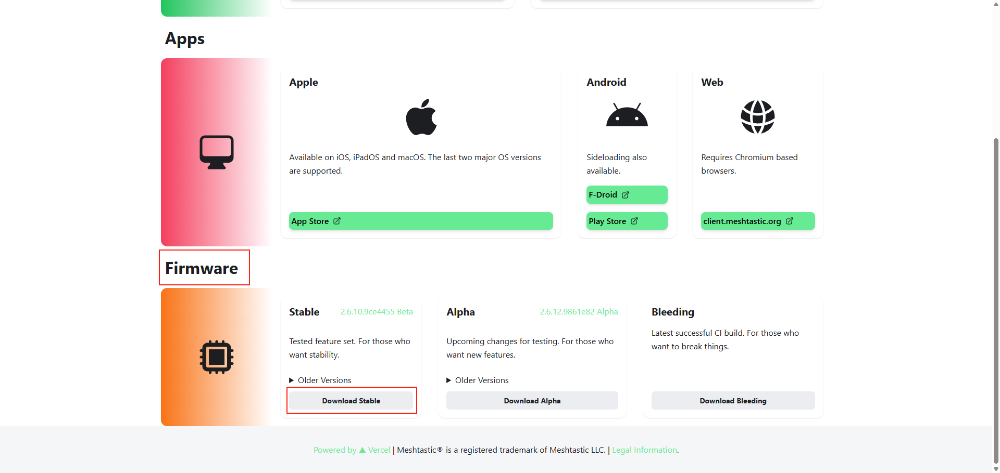
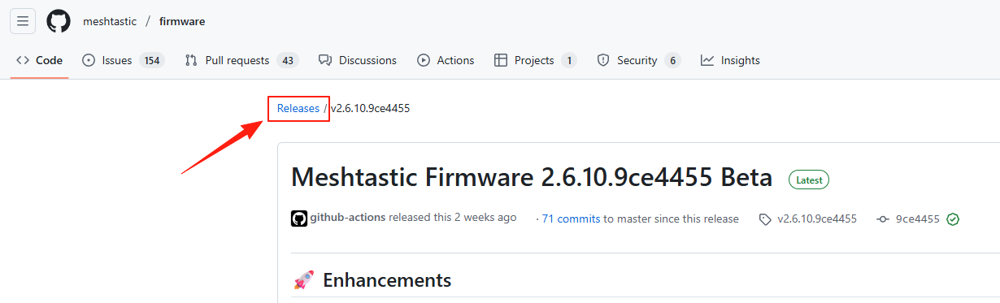
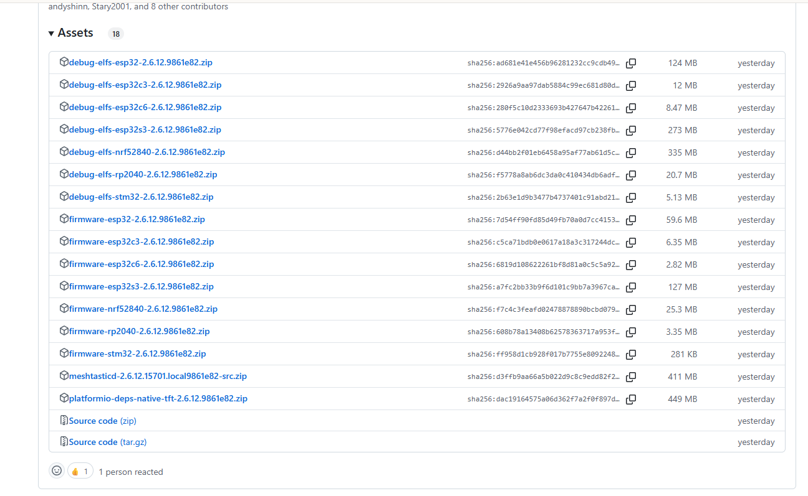
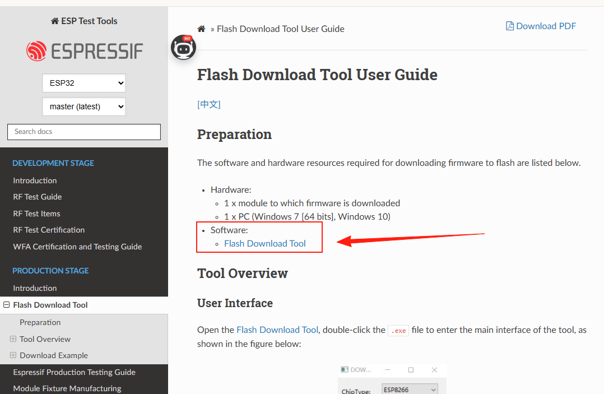
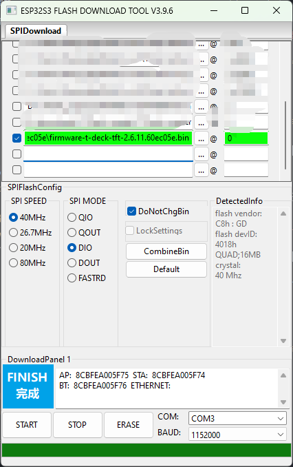

<!-- **[English](README.MD) | 中文** -->

<!-- 

    <a target="_blank" style="margin: 1em;color: white; font-size: 0.9em; border-radius: 0.3em; padding: 0.5em 2em; background-color:rgb(63, 201, 28)" href="https://item.taobao.com/item.htm?id=846226367137">淘宝</a>
    <a target="_blank" style="margin: 1em;color: white; font-size: 0.9em; border-radius: 0.3em; padding: 0.5em 2em; background-color:rgb(63, 201, 28)" href="https://www.aliexpress.com/store/911876460">速卖通</a>

 -->
>!了解更多可进入[Meshtastic](https://meshtastic.org/docs/hardware/devices/lilygo/)

## 更新固件

### 固件获取

点击右上角Download按钮

找到Firmware这一栏,点击Download Stable跳转到github的release页面下载固件

点击releases可以查看到最新的固件版本

确认好固件的版本点击进入详情往下滑找到Assets下载固件

这里根据芯片的型号下载对应的固件

### 工具获取

下载好固件后需要烧录到开发板上，这里推荐使用Flash_Download_Tool工具进行烧录

点击[下载Flash_Download_Tool](https://docs.espressif.com/projects/esp-test-tools/en/latest/esp32/production_stage/tools/flash_download_tool.html)

### 烧录固件
选择好对应的芯片型号和对应的固件文件，点击Start进行烧录

