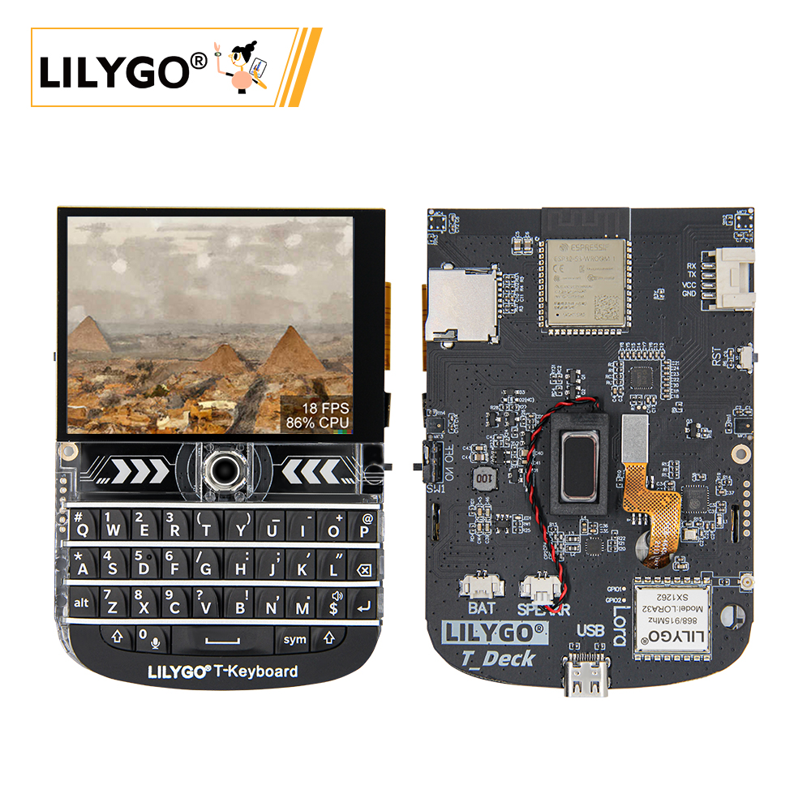
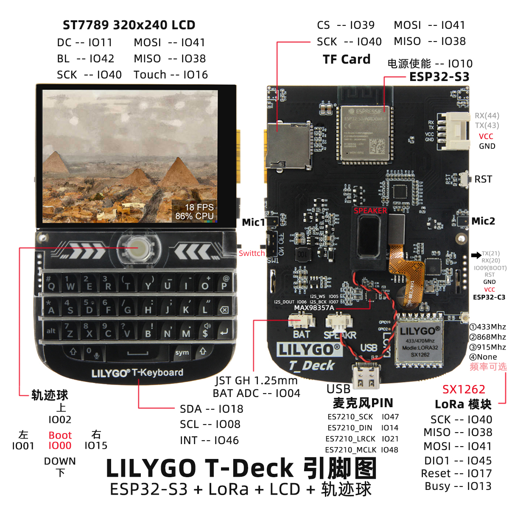

<!-- **[English](README.MD) | 中文** -->

    <a target="_blank" style="margin: 1em;color: white; font-size: 0.9em; border-radius: 0.3em; padding: 0.5em 2em; background-color:rgb(63, 201, 28)" href="https://lilygo.cc/products/https://lilygo.cc/products/t-deck">官网购买</a>
    <!-- <a target="_blank" style="margin: 1em;color: white; font-size: 0.9em; border-radius: 0.3em; padding: 0.5em 2em; background-color:rgb(63, 201, 28)" href="https://www.aliexpress.com/store/911876460">速卖通</a>-->

 

## 简介

LILYGO T-Deck 是一款高度集成的多功能嵌入式开发平台，基于 ESP32-53 主控芯片设计，融合了 2.4 英寸 320x240 分辨率 ST7789 显示屏、轨迹球导航模块（含方向键与 BOOT 按键）、物理键盘接口（通过 I²C 通信）、TF 卡存储扩展、LoRa 无线通信模块（支持 SCK/MISO/MOSI 及控制引脚），以及 ES7210 麦克风阵列（用于音频输入）。其引脚布局兼顾了显示驱动（DC/BL/SPI）、触摸控制、传感器交互（SDA/SCL/INT）、电源管理（BAT ADC）及模块化扩展（SPI/I²C/UART），可快速实现物联网终端、便携式交互设备或低功耗无线通信项目的开发。

## 外观及功能介绍
### 外观

### 引脚图 

## 模块资料以及参数
### 开发板参数

> T-Deck版本没有触摸屏，使用轨迹球导航模块代替。

| 组件 | 描述 |
| ---  | --- |
|MCU	|ESP32-S3FN16R8 Dual-core LX7 microprocessor
|Flash 	|16M 
|PSRAM  |8M
|Lora|	SX1262 433Mhz~915Mhz(可选)
|GPS	|MIA-M10Q
|无线| 2.4 GHz Wi-Fi & Bluetooth 5 (LE)
|存储 | TF 卡 |
|屏幕| 2.8英寸 ST7789 320 x 240 LCD屏幕
|电池容量 |	2000mAh
|控制方式	| 轨迹球 触摸屏 
|输入| 键盘
|麦克风|    MSM381A3729H9CP
|开关	|支持电源开关
| 按键 | 1 x RST 按键 + 1 x BOOT 按键(轨迹球)  |
|音频	|ES7210
| USB |1 × type-C接口|
|IO 拓展	| 2mm间隔 6pin拓展接口
| 拓展接口 | GPS拓展接口 + 2 × JST GH 1.25mm  + 1 x 4pin拓展接口 |
| 孔位 | 2mm 定位孔 |
| 尺寸 | **10x6.8x1.1 cm**  |

### 相关资料
Github：[T-Deck](https://github.com/Xinyuan-LilyGO/T-Deck)
* [T-Deck ANT 868-915MH](https://github.com/Xinyuan-LilyGO/T-Deck/blob/master/datasheet/T-Deck%20ANT%20868-915MHZ.pdf.pdf)
* [T-Deck ANT 433MHZ](https://github.com/Xinyuan-LilyGO/T-Deck/blob/master/datasheet/T-Deck%20ANT%20433MHZ.pdf)

#### 原理图

[T-Deck](https://github.com/Xinyuan-LilyGO/T-Deck/blob/master/schematic/schematic.pdf)

<!-- * [SY6970](./datasheet/AN_SY6970.pdf) -->

#### 依赖库

* [AceButton](https://github.com/bxparks/AceButton)
* [Arduino_GFX](https://github.com/moononournation/Arduino_GFX)
* [ESP32-audioI2S](https://github.com/schreibfaul1/ESP32-audioI2S)
* [RadioLib](https://github.com/jgromes/RadioLib)
* [SensorsLib](https://github.com/lewisxhe/SensorsLib)
* [TFT_eSPI](https://github.com/Bodmer/TFT_eSPI)
* [TinyGPSPlus](https://github.com/mikalhart/TinyGPSPlus)
* [TouchLib](https://github.com/mmMicky/TouchLib)
* [LVGL](https://github.com/lvgl/lvgl/tree/v8.4.0)

## 软件开发
### Arduino 设置参数

|Arduino IDE 设置	|参数   
| ----------- | -----------|                         
|Board     |	ESP32S3 Dev Module
|Port      |    Your port                        
|USB CDC On Boot	|Enable
|CPU Frequency	|240MHZ(WiFi)                      
|Core Debug Level	|None                              
|USB DFU On Boot	|Disable                          
|Erase All Flash Before Sketch Upload	|Disable                          
|Events Run On	|Core1                            
|Flash Mode	|QIO 80MHZ                        
|Flash Size	|16MB(128Mb)                  
|Arduino Runs On	|Core1                            
|USB Firmware MSC On Boot	|Disable                          
|Partition Scheme	|16M Flash(3M APP/9.9MB FATFS)
|PSRAM	|OPI PSRAM                    
|Upload Mode	|UART0/Hardware CDC            
|Upload Speed	|921600                            
|USB Mode	|CDC and JTAG      

### 开发平台
1. [VS Code](https://code.visualstudio.com/)
2. [Arduino IDE](https://www.arduino.cc/en/software)
3. [Platform IO](https://platformio.org/)
4. [Micropython](https://micropython.org/)

## 产品技术支持 

