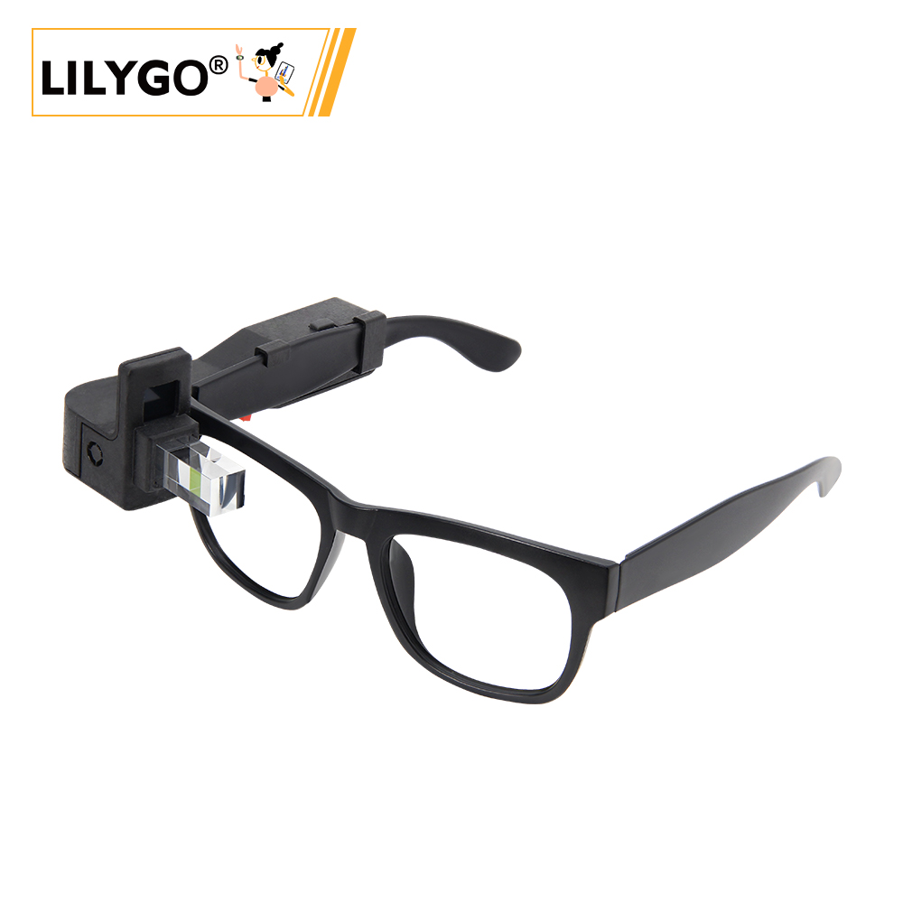

<!-- **[English](README.MD) | 中文** -->

    <a target="_blank" style="margin: 1em;color: white; font-size: 0.9em; border-radius: 0.3em; padding: 0.5em 2em; background-color:rgb(63, 201, 28)" href="https://lilygo.cc/products/t-glass">官网购买</a>
    <!-- <a target="_blank" style="margin: 1em;color: white; font-size: 0.9em; border-radius: 0.3em; padding: 0.5em 2em; background-color:rgb(63, 201, 28)" href="https://www.aliexpress.com/store/911876460">速卖通</a> -->

## 简介

LILYGO T-Glass 是一款基于ESP32-S3主控芯片的智能可穿戴设备，集成BHI260AP运动传感器和JD96013A型号的AMOLED显示屏，具备126×126像素的可见显示区域，支持触控交互与高对比度视觉效果。内置4MB Flash和2MB OSPI PSRAM，确保流畅运行与数据存储能力。功能模块丰富，包含实时时钟（RTC）、麦克风（支持MIC_CLOCK/MIC_DATA音频输入）、振动反馈（Vibration_Pin）、电池电量监测（BAT_ADC）以及触摸按键（Touch_Button），适用于运动追踪、智能提醒等场景。通过LILYGOT-GlassPINMAP接口方案，整合了SPI、I²C等通信协议，优化了硬件布局，适合轻量化设计需求，如智能眼镜或便携式穿戴设备，兼具低功耗与高性能特性。

## 外观及功能介绍
### 外观

### 引脚图 

## 模块资料以及参数
### 概述

>!T-Glass有两个版本，最初的预览版和T-GlassV2版本（改进的棱镜反射法）。两者的区别只是显示方式不同，硬件是一样的
>T-Wristband和T-Glass拥有相同的硬件，但由于外壳的不同，观看区域有所不同。
>LilyGO T-Wristband和T-Glass依赖于lvgl v8.4.x版本。目前lvgl已经发布了lvgl v9.0版本。当编译错误时，请检查lvgl是否属于v8.4.x
>T-Wristband和T-Glass的视觉尺寸与实际屏幕尺寸不同。所有的例子都是基于lvgl图形框架。其他映像框架（如TFT_eSPI）在这里不可用。

| 组件 | 描述 |
| --- | --- |
| MCU | ESP32-S3 FN4R2  |
| PSRAM | 2MB |
| FLASH | 4MB |
| 屏幕 | 1.1英寸 全彩色 LTPS AMOLED JD9613 (294*126) |
| 触摸 | 侧面触摸按钮 |
| AI智能传感器 | BHI260AP
| 开关 | 侧面电源开关 |
| 电池 | 锂电池 |
| 麦克风 | 支持MIC_CLOCK/MIC_DATA音频输入 |
| 无线 |2.4 GHz Wi-Fi & Bluetooth 5 (LE)
| USB | 1 × USB Port and OTG(TYPE-C接口) |
| 拓展接口|  2 × QWIIC 4 pin接口 |
| 按键 | 1 x RESET 按键 + 1 x BOOT 按键|
| 尺寸 | **140 x 67 x 111mm**  |

### 相关资料

Github：[T-Glass](https://github.com/Xinyuan-LilyGO/LilyGO-T-Wristband-and-T-Glass)

- [JD9613 Driver](https://github.com/Xinyuan-LilyGO/LilyGO-T-Wristband-and-T-Glass/blob/master/datasheet/JD9613_DS_Preliminary_V0.02_20210325.pdf)
- [ESP32S3-FN4R2](https://www.espressif.com.cn/en/support/documents/technical-documents?keys=&field_type_tid%5B%5D=842)
- [BHI260AP](https://www.bosch-sensortec.com/products/smart-sensor-systems/bhi260ap/)
- [PCF85063A](https://www.nxp.com/products/analog-and-mixed-signal/real-time-clocks/rtcs-with-ic-bus/tiny-real-time-clock-calendar-with-alarm-function-and-ic-bus:PCF85063A)

#### 原理图

* [T-Glass](https://github.com/Xinyuan-LilyGO/LilyGO-T-Wristband-and-T-Glass/blob/master/schematic/LilyGO-T-Wristband-and-T-Glass.pdf)

#### 依赖库

- [SensorLib 0.1.8](https://github.com/lewisxhe/SensorsLib)
- [lvgl 8.4.0](https://github.com/lvgl/lvgl/tree/release/v8.4)
- [MadgwickAHRS](https://github.com/arduino-libraries/MadgwickAHRS)

## 软件开发
### Arduino 设置参数

| Arduino IDE Setting                  | Value                                          |
|--------------------------------------|------------------------------------------------|
| Board                                | ESP32S3 Dev Module                             |
| Port                                 | Your port                                      |
| USB CDC On Boot                      | Enable                                         |
| CPU Frequency                        | 240MHZ(WiFi)                                   |
| Core Debug Level                     | None                                           |
| USB DFU On Boot                      | Disable                                        |
| Erase All Flash Before Sketch Upload | Disable                                        |
| Events Run On                        | Core1                                          |
| Flash Mode                           | QIO 80MHZ                                      |
| Flash Size                           | 4MB(32Mb)                                      |
| Arduino Runs On                      | Core1                                          |
| USB Firmware MSC On Boot             | Disable                                        |
| Partition Scheme                     | Default 4M with spiffs(1.2M APP/1.5MB SPIFFS)  |
| PSRAM                                | QSPI PSRAM                                     |
| Upload Mode                          | UART0/Hardware CDC                             |
| Upload Speed                         | 921600                                         |
| USB Mode                             | CDC and JTAG                                   |

### 开发平台
1. [Micropython](https://micropython.org/)
2. [Arduino IDE](https://www.arduino.cc/en/software)
3. [Platform IO](https://platformio.org/)

## 产品技术支持 

