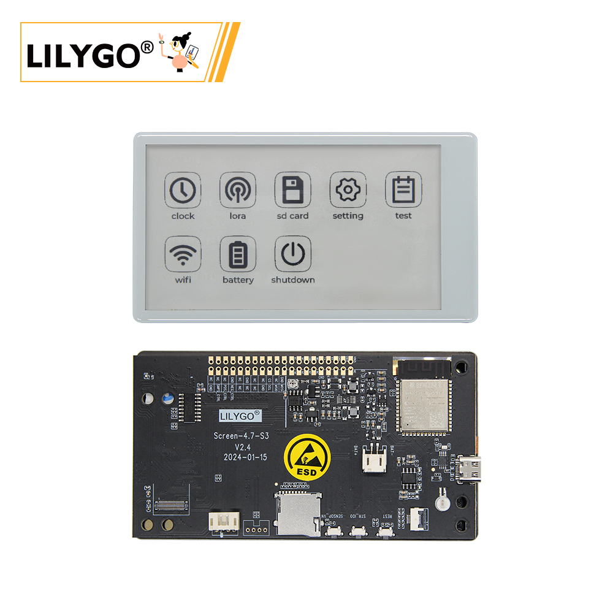
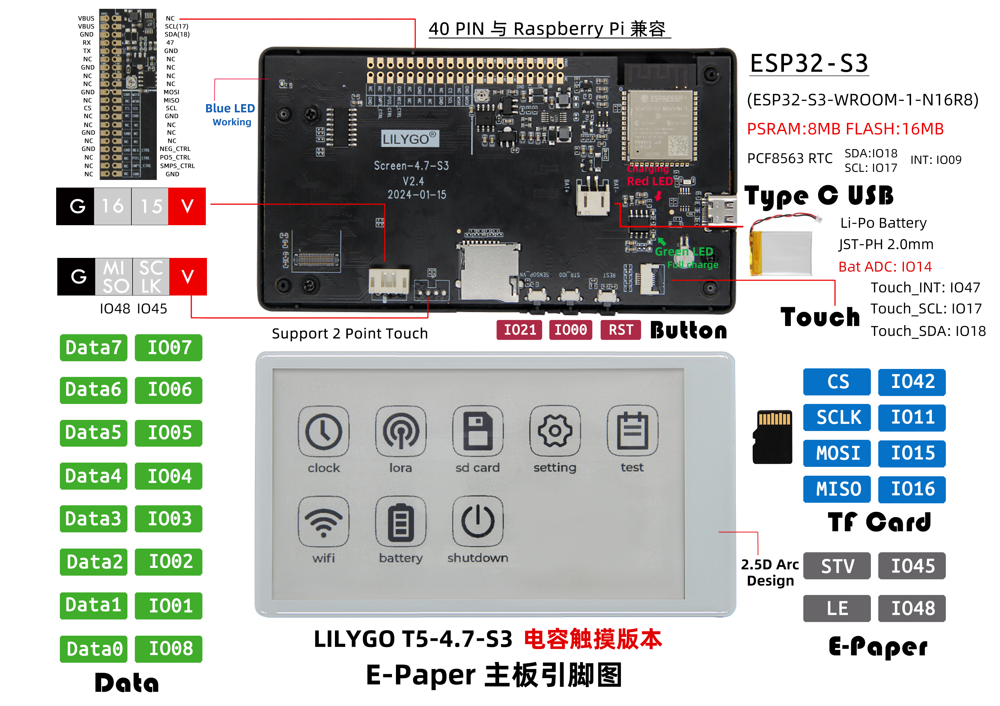

<!-- **[English](README.MD) | 中文** -->

<!-- 

    <a target="_blank" style="margin: 1em;color: white; font-size: 0.9em; border-radius: 0.3em; padding: 0.5em 2em; background-color:rgb(63, 201, 28)" href="https://item.taobao.com/item.htm?id=846226367137">淘宝</a>
    <a target="_blank" style="margin: 1em;color: white; font-size: 0.9em; border-radius: 0.3em; padding: 0.5em 2em; background-color:rgb(63, 201, 28)" href="https://www.aliexpress.com/store/911876460">速卖通</a>

 -->

## 简介

LILYGO T5-4.7-S3 电容触摸屏开发板是一款基于 ESP32-S3-WROOM-1-N16R8 芯片（内置 8MB PSRAM 和 16MB Flash）的 4.7 英寸电子墨水屏（E-Paper）解决方案。该产品集成了电容式触摸功能（支持两点触控），配备了 PCF8563 实时时钟芯片，并设有 Type-C USB 接口以及 Li-Po 电池接口（JST-PH 2.0mm），支持电池电压监测（Bat ADC）。它提供兼容树莓派 40-PIN 的 GPIO 扩展接口，板载 TF 卡槽，具备专用的屏幕驱动信号（STV/LE）和 SPI 接口（CS/SCLK/MOSI/MISO），并采用 2.5D 弧面设计，专为开发低功耗、带触控交互的电子墨水屏应用（如信息牌、智能家居显示终端、便携设备等）而设计。

## 外观及功能介绍
### 外观

### 引脚图 

## 模块资料以及参数
### 开发板参数

| 组件 | 描述 |
| ---  | --- |
|MCU	|ESP32-S3-WROOM-1-N16R8
|Flash 	|16M 
|PSRAM  |8M
|无线| 2.4 GHz Wi-Fi& BLE 5
|存储 | TF 卡 |
|屏幕 |  EDO47TC1 4.7英寸低功耗墨水屏(540 x 960)
|触摸	|GT911 
|时钟	|PCF8563 
|按键 | 1 x RST 按键 + 1 x SIR_io0 按键 + 1 x io21 按键 |
|IO 拓展	| 2 x 20pin拓展接口(与树莓派兼容) 
|拓展接口 | 1 x JST-PH 2.0mm 电池接口 + 2 x 4pin Molex连接器  |
|孔位 | 6 x 3.8mm 定位孔  |
|尺寸 | **121x67x12mm**  |

### 相关资料
Github：[T5 E-paper](https://github.com/Xinyuan-LilyGO/LilyGo-EPD47/tree/esp32s3)

* [ED047TC1](https://github.com/Xinyuan-LilyGO/LilyGo-EPD47/blob/esp32s3/datasheet/ED047TC1.pdf)

#### 原理图

[T5 E-paper](https://github.com/Xinyuan-LilyGO/LilyGo-EPD47/blob/esp32s3/schematic/T5-ePaper-S3-V2.4.pdf)

<!-- * [SY6970](./datasheet/AN_SY6970.pdf) -->

#### 依赖库

* [Button2](https://github.com/LennartHennigs/Button2)
* [SensorLib@0.19](https://github.com/lewisxhe/SensorsLib)                        

## 软件开发
### Arduino 设置参数

| Arduino IDE 设置                     | 参数                             |
|--------------------------------------|--------------------------------|
| Board                                | ESP32S3 Dev Module             |
| Port                                 | Your port                      |
| USB CDC On Boot                      | Enable                         |
| CPU Frequency                        | 240MHZ(WiFi)                   |
| Core Debug Level                     | None                           |
| USB DFU On Boot                      | Disable                        |
| Erase All Flash Before Sketch Upload | Disable                        |
| Events Run On                        | Core1                          |
| Flash Mode                           | QIO 80MHZ                      |
| Flash Size                           | 16MB(128Mb)                    |
| Arduino Runs On                      | Core1                          |
| USB Firmware MSC On Boot             | Disable                        |
| Partition Scheme                     | 16M Flash(3M APP/9.9MB FATFS)  |
| PSRAM                                | OPI PSRAM                      |
| Upload Mode                          | UART0/Hardware CDC             |
| Upload Speed                         | 921600                         |
| USB Mode                             | CDC and JTAG                   |
| Programmer                           | Esptool                        |

### 开发平台

1. [ESP-IDF](https://www.espressif.com/zh-hans/products/sdks/esp-idf)
2. [Arduino IDE](https://www.arduino.cc/en/software)
3. [VS Code](https://code.visualstudio.com/)
4. [Micropython](https://micropython.org/)

## 产品技术支持 

